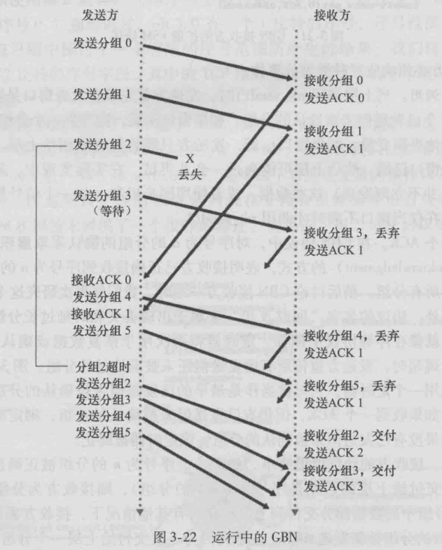
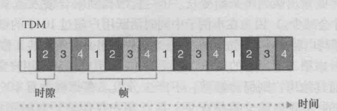
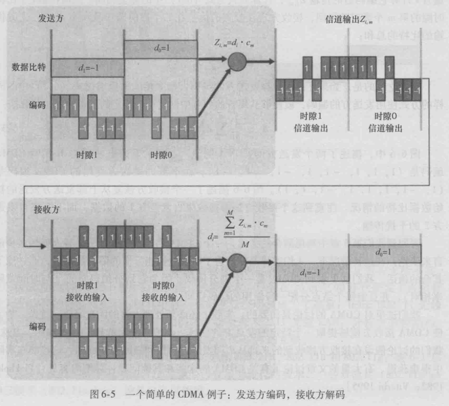
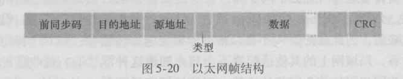

# 数据链路层综述

## 功能

### 为网络层提供服务

### 差错控制

### 流量控制

### 组帧

### 链路管理

# 组帧

## 字符记位法

## 字符填充首尾定界法

## 零比特填充首为标志法

## 违规编码法

# 差错控制

## 检错编码

### 奇偶校验码

### CRC码

## 纠错编码

### 海明码

# 流量控制和可靠传输

## 流量控制：滑动窗口协议

流量控制本质上是限制发送方的流量和接收方一致。滑动窗口在发送方和接收方都有，但发送窗口一定比接收窗口大

滑动窗口协议具有以下特性：

- 接收窗口移动时（发送ACK给发送方），发送窗口才有可能移动（收到ACK时一定）
- 停等，GBN和选择重传都是滑动窗口协议，只是窗口大小不一致
  
## 可靠传输：自动重传ARQ协议

### 停止等待协议

发送方发送一个数据之后就停止发送，等待接收方的ACK到达再进行接下来的发送

当帧丢失时，停等会无休止的等待永远不会发送出来的ACK，为此每次发送帧时，启动一个超时定时器，当计时器满时仍未收到ACK，则重传该分组

此外，为了实现重传，要设置一个缓冲区保留副本，以便出错时重传

停止等待协议信道的利用率很低，为此产生了多帧滑动窗口协议GBN和SR协议

### 回退N步GBN协议

GBN协议是发送窗口大小为N，接收窗口大小为1的滑动窗口协议。GBN的特点可以概括为**连续发送，顺序接收，累积确认**

- 连续发送：由于GBN的发送窗口大小为N，故不用像停等协议那样发送一个帧便停止，可以连续发送。
- 顺序接收：但是GBN的接收窗口大小为1，当出现失序的分组时，便要求发送方发送所有已发送但未确认的分组
- 累积确认：为了减少开销，GBN规定发送方不一定收到一个分组便发送一个ACK，而是可以连续收到好几个分组以后再发送
- **收到ACKn，表示第n号帧及其i以前所有帧都以及正确发送**

发送窗口大小应满足$W_T<2^n-1$

GBN由于出现错误就回退N步的特性，其效率不一定比停等协议好

### 选择重传协议

>SR协议是为了避免GBN出现差错时全部推倒重发的问题，顾名思义，选择重发，选择出现差错的分组进行重发

SR协议是发送方和接收方的滑动窗口都为多帧的滑动窗口协议。SR的特点可以概括为**连续发送，来则不拒，失序缓存，按序连续交付**

- 连续发送：和GBN一样都为多帧窗口，故可以连续发送
- 来者不拒，失序缓存：与GBN不同的是，接收方会缓存所有失序的分组，为此接收方会设置一个相当容量的缓冲区，当失序分组来到时将其存入缓冲区中
- 按序连续交付：失序分组不断加入缓冲区，当缓冲区的失序帧有序时，便将这些有序分组一次性全部发送

SR协议的窗口大小应满足：
- $W_T+W_R\le 2^n$
- 发送窗口不小于接收窗口
- 当发送=滑动时候，满足$W_T=W_R\le2^{n-1}$

对于滑动窗口协议来说，计算信道利用率是一个高频考点

信道利用率$U=\frac{L/C}{T}$,其中T为发送周期：发送方开始发送数据到收到第一个ACK的时间；C为发送方数据传输率；L为一个发送周期内发送方发送的比特数

# MAC

MAC(Medium Access Control 介质访问控制)可以说是链路层最重要的一个组成部分，下文所有的MAC协议都是为了解决多路访问问题，即多个节点共享单个广播通路

## 信道划分MAC

信道划分MAC是将信道的时域、频域合理的划分给网络上的设备的技术

### 时分TDM

将时间分成若干时间片，轮流分配给多个信号

### 频分FDM

链路的频谱由跨越链路创建的所有连接共享

由此可见，FDM和TDM都是共享带宽，每个节点速率为$\frac{R}{N},$其中R为线路贷款，N为信道划分的路数

若采用STDM，STDM不固定分配slot，而是动态分配，因而可占用全部带宽

### 波分WDM

波分复用即光的FDM

### 码分多址CDMA

>曾经考察过CDMA的原理，作为无线网络/蜂窝网络的MAC协议，不排除考察的可能性

与TDM和FDM不同，CDMA为每个节点分配不同的编码，如果使得不同的节点所拥有的编码向量相互正交，则多个节点可以同时发送不被干扰，因而广泛用于蜂窝网络和无线网络

图为单个发送方的CDMA情况，每个发送比特$d_i$都需要一个比特slot，CDMA将每个比特slot划分为M个微slot，实际中的M为64或128。为了数学上方便，比特0的$d_i=-1$

CDMA为发送方设定了一个M比特编码序列$c_m，m=1,2...M$，图中发送方的编码序列为(1,1,1,-1,1,-1,-1,-1)

每个被发送的比特都被编码成$Z_{i,m}=d_i\cdot c_m$然后送给接收方，接受方进行解码$d_i=\frac{Z_{i,m}\cdot c_m}{M}$便可求出原始的比特

而对多个发送方的情况，则要求每个发送方的编码序列相互正交，再根据上面的公式进行解码即可

## 随机访问MAC

### ALOHA协议

#### 纯ALOHA协议

纯ALOHA协议可以概括为**想发就发，随机重发**

- 想发就发：网络中的节点发送数据时不用进行任何检测
- 随即重发：等待一段随机的时间重发，若再

纯ALOHA协议的冲突概率极高，因此效率极低

#### 时隙ALOHA协议

时隙ALOHA协议是在纯ALOHA协议上进行的改进。将时间分为一段段时间片（时隙）。所有节点在时隙的开始时刻发送数据，若发生冲突，则延迟到下一个时隙在进行重发

### CSMA协议

CSMA（Carrier Sense Multiple Access，载波侦听多路访问）是在ALOHA协议的基础上加上了载波侦听的功能。节点在发送数据之前要先侦听

如何进行载波侦听？检测电压的变动

CSMA协议分为1坚持，非坚持和p坚持三种

- 1坚持：1坚持CSMA中，如果信道空闲，就发送数据，若信道忙，则等待，并**持续侦听**，直到侦听到信道空闲，立刻发送数据。1坚持CSMA会导致大量的冲突，效率低
- 非坚持：非坚持CSMA中，信道空闲，发送数据；若信道忙，则选择一个随机时间再侦听。非坚持CSMA减少了1坚持CSMA所导致的冲突，但也会增加网络的平均时延
- p坚持：p坚持CSMA中，若信道空闲，则以p的概率发送数据，以1-p的概率推迟到下一个时间片再发，若信道忙，则持续侦听(此处的持续侦听是推迟到下一个时间片再侦听)
- 
### CSMA/CD协议

CSMA/CD（Carrier Sense Multiple Access/collision detection，载波侦听多路访问\碰撞检测）是在CSMA协议的基础上加上了碰撞检测的功能。

CSMA/CD的特点概括起来就是**先听再说，边听边说，冲突停发，随机重发**

- 先听再说：CSMA的特点
- 边听边说，冲突停发：CSMA/CD在发送数据的过程中会持续侦听，以判断自己发送时其他节点是否也在发送，若未检测到碰撞，则顺利发送数据；若侦听到有碰撞，则停止发送，并发送一个拥塞信号以通知其频考点

另外，以太网规定最短帧长为64B

指数退避算法：为了避免发生碰撞后紧接继续发送所导致的无休止冲突，CSMA/CD采用了二进制指数退避算法：

1. 设定基础时间：一般为争用期$2\tau$
2. 设定参数：设k为重传次数，$k=\min[重传次数，10]$，也就意味着重传次数超过10之后k便不再增大。每次从序列$\{0,1,...,2^{k}-1\}$中随机选取一个数r作为参数
3. 重传等待时间$t=2r\tau$
4. 当重传次数累积到16次时，可以认定网络太拥挤，认定此帧无法发送，丢弃并向上层发送错误报告
  
CSMA\CD常用于有线连接的局域网

### CSMA/CA协议

在无线局域网中，不能简单的使用CSMA/CD协议，因为：

1. 存在隐蔽站问题：并非所有节点都能听见对方
2. 实现碰撞检测的代价过大

故IEEE802.11采用了CSMA/CA（Carrier Sense Multiple Access/collision Avoidance）协议，协议的细节如下：

- CSMA/CA采用确认重传方案，发送完一个帧要收到对方确认帧后才能继续发送
- 所有站发送完成后，必须等待一段很短的时间（Interframe Space IFS）才能继续发送，有以下几种IFS：
  1. SIFS：短IFS，用于各种控制帧，如CTS，ACK
  2. PIFS
  3. DIFS：最长的IFS，用于预约帧RTS
- CSMA/CA的重传机制和CSMA/CD不同，信道持续侦听，当检测到空闲，在等待一个DIFS后，发送整个数据帧；否则，就像CSMA/CD一样执行退避算法，选择一个随机时间，但是CSMA/CA中的时间是一个计时器：当检测到信道忙，冻结计时器；当检测到空闲，计时器进行倒计时，当倒计时为0,重发帧。
- 若收到确认帧，发送第二帧要重新回到退避算法处进行处理
  
RTS和CTS：为了解决隐蔽站的问题，CSMA/CA允许站点预约信道。当站点发送数据帧前先广播一个RTS（Request for Send）控制帧，AP收到这个控制帧，当信道空闲时广播一个CTS（Clear to Send）其他站点收到CTS便延迟发送，源站点则允许发送

信道预约不是强制约定，而是要根据现实情况进行权衡，一般来说只有数据帧长度超过某一数值时使用信道预约才比较有利
## 轮询MAC

### 令牌环

令牌环轮流传递，逻辑拓扑必须是环，而物理拓扑不一定是环

适合高负载广播信道

# 局域网

## 概述

局域网特性由三个要素决定：网络拓扑结构，传输介质和MAC：

- 拓扑结构：星形结构，总线形结构，环形结构，复合型结构
- 传输介质：双绞线，铜缆，光纤，双绞线是主要传输介质
- MAC：CSMA/CD，令牌总线和令牌环

几种局域网：

- 以太网（IEEE 802.3）最普遍的局域网，物理拓扑是星形或拓展形，逻辑拓扑是总线形
- 令牌环（IEEE 802.5）物理拓扑是星形，逻辑拓扑是环形
- FDDI（光纤分布数字接口 IEEE 802.8）物理拓扑是双环，逻辑拓扑是环形

IEEE 802规定的几种局域网一般包括OSI/ISO模型里的链路层和物理层

## 以太网和IEEE802.3

以太网是使用最为广泛的局域网，以太网有以下特点：

- 无连接的工作方式：数据传送时不用建立连接，不编号，提供尽力而为不可靠服务
- 以太网采用曼切斯特编码
- 以太网实现无差错接受，不实现可靠传输，可靠服务由上层（运输层）来实现
- 以太网采用CSMA/CD协议

### 传输介质和网卡

以下表格列出各种传输介质（考试中属于常识，不会在题目中给出）

参数|10BASE5|10BASE2|10BASE-T|10BASE-FL|
:-:|:-:|:-:|:-:|:-:|
传输媒体|同轴粗缆|同轴细缆|双绞线|光纤
编码|曼切斯特编码|曼切斯特编码|曼切斯特编码|曼切斯特编码
拓扑结构|总线形|总线形|星形|总线形
最大段长|500|185|100|2000

网卡：链路层在主机的网卡上运行。

### MAC帧

MAC地址，也叫物理地址，由12个16进制数组成，如xx-xx-xx-xx-xx-xx，高24位为厂商代码，低24位为厂商自行分配的序列号，MAC地址是唯一的

- 前同步码：**不属于MAC帧**，8个字节，前七个字节是10101010，最后一个字节是10101011，前七个字节用于唤醒网卡，并同步时钟，前同步码后面两个bit告诉网卡MAC帧要到来了

- 地址：6字节MAC地址
- 类型：2字节，指出协议类型
- 数据：46～1500字节，若不足46字节，则需要填充，若超过1500字节，则需要进行进一步划分
- CRC：CRC循环冗余校验码

### 高速以太网

- 100BASE-T：半双工/全双工，双绞线，CSMA/CD
- 吉比特以太网：半双工（向后兼容CSMA/CD，双绞线）/全双工（不需要CSMA/CD，光纤）
- 10吉比特以太网：全双工，光纤

## 无线局域网和IEEE802.11

### 概念

### IEEE802.11首部地址字段

## VLAN虚拟局域网

# 数据链路层设备

## 网桥

## 链路层交换机