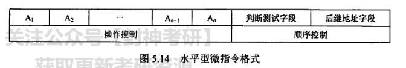

>CPU是计算机组成原理里最复杂的一章，重点是指令周期，数据通路，指令流水线。这部分会考3题左右的选择题，大题涉及流水线和数据通路，综合性较强，难度较大，不过已经很多年没出过大题了。

# CPU的结构

## 运算器

运算器是CPU的执行部件，用于接收控制器发来的命令并执行。

- 算术逻辑单元ALU：进行算数/逻辑运算
- 暂存寄存器：暂存从数据通路读来的数据
- 累加寄存器ACC：用于暂存ALU运算结果，可作为加法运算的输入
- 通用寄存器组：AX，BX，CX，DX，SP等，用于存放操作数。SP为堆栈指针，用于指示栈顶的地址
- 程序状态字寄存器PSW：保存运算或指令结果所建立的各种状态信息，具体见第二章，有ZF，SF，OF，CF
- 移位器：进行移位运算，也有移位寄存器
- 计数器：控制乘除运算操作步数

## 控制器

控制器的CPU的中枢，控制器的基本功能是执行指令

- 程序计数器PC：用于存放下一条指令的地址，CPU根据PC的内容取主存读取指令。PC有自增功能，(PC)+1->PC
  >PC如何自增？与ALU配合，在多路选择器（MUX）的一端设置为指令字长，PC需自增时便使PC与指令字长相加得到下一条指令。
- 指令寄存器IR
- 指令译码器
- 存储器地址寄存器MAR
- 存储器数据寄存器MDR
- 时序
- 微操作信号发生器

## 功能

- 指令相关：取指令，分析指令，执行指令
- 操作控制：指的是控制器根据时序，程序状态字标志位，并根据指令译码内容发出一系列控制信息，从而实现对计算机部件的控制
- 时间控制
- 数据加工
- 中断处理：CPU响应中断请求（中断隐指令）

## 寄存器

寄存器是计算机中速率最快的存储器，能和CPU的速度相匹配，计算机中有两种寄存器，一种是用户可见寄存器，一种是用户不可见寄存器

用户可见寄存器：
- 通用寄存器：包含PC，ACC，和其他通用寄存器组
- 程序状态字寄存器

用户不可见寄存器：
- 指令寄存器
- MAR，MDR
- 暂存寄存器

## 数据通路

数据在CPU内部的部件及其之间传送的路径为**数据通路**，注意区分系统总线和数据通路（内部总线）

- 系统总线：计算机系统的各部件，如CPU，主存，通道和IO设备之间连接的总线
- 内部总线：CPU内部连接各寄存器和运算部件之间的总线


- 带in/out是控制器发出的控制信号
- Y，Z是暂存寄存器

### 内部单数据通路

所有寄存器输入端和输出端连接到一条公共通路上，**一个时钟内只允许一次操作**

### 三总线通路

### 专用数据通路

### PC->MAR的数据传送

1. (PC)->Bus PCout=1, (PC)->Bus
2. Bus->MAR MARin=1, Bus->MAR

### 主存->CPU之间的数据传送

1. (PC)->Bus->MAR, PCout=1, MARin=1
2. 1->R, CU发出读命令
3. M(MAR)->MDR, MDRin=1
4. MDR->Bus->IR, MDRout=1, IRin=1

### 执行算数和逻辑运算

1. AD(IR)->Bus->MAR, MDRout=1, MARin=1
2. 1->R
3. MEM->MDR, MDRin=1
4. MDR->Bus->Y, Yin=1, MDRout=1
5. (ACC)+(Y)->Z, ACCout=1, ALUin=1
6. Z->ACC, Zout=1, ACCin=1

# 指令执行过程

## 指令周期

CPU取指到执行完指令的时间叫指令周期。

指令周期一般用若干个机器周期来表示，而机器周期包含若干个时钟周期（CPU操作最基本操作）。

每个指令周期的机器周期可以不等，每个机器周期所包含的时钟周期也可以不等

一般而言指令周期可以分为取值周期，间址周期，执行周期和中断周期。不同指令所包含的周期种类不同

对于无条件转移JMP X，操作数在指令中给出，执行过程不用访存，只有取值周期和执行周期

对于间接寻址的指令，需要先访存得到EA然后再访存得到操作数，故有取值周期，间址周期和执行周期

现代计算机采用中断实现主机和IO交换信息。执行执行结束前，要检测是否有中断请求，则进入中断响应阶段，也叫中断周期


## 标志触发器

为了区分不同的工作周期，在CPU中设置标志触发器FE（取指），IND（间址），EX（执行），INT（中断）。

## 取指周期

取指周期所做的事为

1. 根据PC的值从主存/cache/指令cache中取出指令
2. 取出的指令放到IR中

过程：
1. (PC)->MAR->MM
2. 1->R
3. M(MAR)->MDR
4. (MDR)->IR
5. (PC)+1->PC

## 间址周期

间址周期根据指令中的间接地址去访存获得有效地址

过程：
1. OP(IR)->MAR,或MDR->MAR
2. 1->R
3. M(MAR)->MDR

## 执行周期

每条指令执行其所实现的功能，由于不同指令的操作不同，故没有一个统一的流程

## 中断周期

中断周期用于处理中断请求。当指令结束后，CPU会检测是否有中断请求信号，若有则进行中断响应。中断响应的内容包括关中断保存断点和形成中断向量

假设断点保存在用户堆栈中，由操作系统我们可知堆栈是向低地址增加的，故堆栈指针/堆栈寄存器SP是做减1操作

过程：
1. (SP)-1->SP,SP->MAR
2. 1->w
3. (PC)->MDR->M(MAR)
4. 向量地址->PC

# 控制器的功能和原理
>这部分考察选择题，但是要注意的是，如果不了解这部分知识，就不可能做出这部分的题目。这部分知识比较复杂，但是不用考虑具体微程序/硬布线的实现，这不符合408的风格
## CPU对计算机控制的原理

操作单元的输入信号如下：
1. 操作码译码结果
2. 时钟发出的时钟信号
3. 运算器运算结果产生的程序标志

CU根据以上三种输入信号，产生各种控制信号来控制计算机

## 硬布线

利用逻辑电路实现控制，具体略

### CPU控制方式

- 同步控制方式：系统统一时钟
- 异步控制方式：不存在基准时钟
- 联合控制方式：同步+异步，大部分同步控制，小部分异步控制

## 微程序

微程序控制器采用存储逻辑实现。

可以理解为，微程序控制器是一个将指令处理成微程序，并执行微程序的逻辑上的计算机。

这个逻辑上的计算机有“主存”：控制存储器以及“CPU”：包含微地址寄存器（μPC/CMAR），微指令寄存器（CMDR/μIR）和顺序逻辑等

### 结构

- 控制存储器：用于存放微程序,用ROM实现
- 微地址寄存器：用于存放控存的读写微指令地址
- 微指令寄存器：用于存放从控存中取出的微指令
- 顺序逻辑：用于生成下一条微指令的地址

### 概念区别

- 微程序是由若干微指令组成的，微指令对应若干个微操作。一条指令对应一个微程序，微程序是由微指令序列构成的
- 微操作和微命令是一一对应的，微操作是微命令的执行过程，微命令是微操作的控制信号
- 存放微指令的控存地址称为微地址
- 微周期是从控存中取出一条微指令并执行所需的时间

### 工作过程


1. 取微指令公共操作：机器运行时自动将取指微程序入口地址送入CMAR，并取出对应的微指令送入CMDR
2. 由机器指令的操作码字段通过微地址形成部件产生该机器指令对应的微程序入口地址，送入CMAR
3. 从CM中取指并完成操作
4. 执行完一个微程序后再进行取指操作，循环操作

### 编码方式

1. 直接编码：**一位一命令**，1表示选用0表示不选用。优点是简单直观，缺点是是控存容量极大
  
2. 字符直接编码：在直接编码的基础上，微指令分为若干字段，互斥性微命令组合在同一字段（即同一类微指令），相容性微指令组合在不同字段。需经过译码
  
3. 字段间接编码

### 微地址形成方式

1. 微指令的下地址字段获得（断定方式
2. 根据机器指令的操作码经过微地址形成部件形成（初始）
3. μPC+1

### 微指令格式

1. 水平型微指令：直接编码，字符直接编码，字段间直接编码都属于水平型，特点一条微指令由很多微命令组成，一条微指令可以定义多个并行的操作，导致微指令较长，微程序短
   
2. 垂直型微指令：类似于机器指令，设置**微操作码**，由微操作码指定微指令功能，一条微指令一个操作，微指令短，但是微程序长
   
3. 混合型微指令：缝合怪

# 中断和异常
>中断和异常是408必考考点，我们会在CPU和IO中反复提到，在OS中我们也反复提及
## 概念

异常，也叫内中断，是**CPU内部**产生的异常事件所导致的。中断是由CPU外部设备引起的，也叫外中断。
>CPU内部，指的是控制器和运算器
异常是在**指令执行过程**中发现的，通常是由当前指令所引起的

中断是在**指令执行结束后**检测来自外部设备的中断请求信号所引起的，与当前指令无关

CPU在发现中断（此处将异常和中断统称为中断）后，要打断当前进程，转到相应的中断处理程序进行中断处理。若当前的中断处理程序能够解决该中断，则返回到第i（异常）条指令或第i+1（中断）条指令。若无法处理，则终止进程。
>因为异常是当前指令未正常执行，若完成异常的处理，则需要返回原指令继续执行。而中断是在指令执行结束后进行相应的，此时PC计数器已经+1，而原指令也已经完成，故中断结束后要执行下一条指令

中断处理的过程是由**操作系统和驱动程序**完成的，CPU完成的是**中断隐指令**，包括**关中断，保护断点，形成向量地址**。有关中断的更详细过程我们放在IO中进行更进一步的阐述

## 分类

异常可以分为硬故障和程序异常。

- 硬故障是由硬件出现异常引起的，包括总线错误，存储器错误，这种异常是无法修复的，会导致计算机系统死机，也叫**终止（Abort）**。这类异常也不可屏蔽
- 程序异常包括**故障（fault）**和**自陷（trap）**。故障是由指令执行时产生的，比如非法操作码，缺页中断，整除0，运算溢出，栈溢出，地址越界等等。自陷是故意产生的异常，比如执行系统调用时就会用到自陷；又或者程序调试的断点和单步跟踪也是自陷的应用

中断来自CPU外部，比如IO中断等。CPU在指令执行结束后检测到中断信号后便进入中断周期。

中断可分为可屏蔽中断和不可屏蔽中断

- 可屏蔽中断INTR，可以通过中断屏蔽字和关中断来拒绝响应
- 不可屏蔽中断NMI，通常是硬件故障，这类信号不可屏蔽，响应优先级最高
# 指令流水线
>曾经考过大题，不过很久没考过了。408机组大题的特点是综合性，流水线很容易可以和其他知识点进行综合，需要值得注意。特别要注意指令流水线和内存低位交叉编址类似。注意研究课后的真题，很重要
## 提高并行性的方法

- 空间上并行：一个处理机多个功能部件，如超标量处理器
- 时间上并行：任务分解为多段，如流水线处理器
  
### 流水处理器

### 超标量处理器

## 流水线定义

408中常见的五段流水线：一条指令的执行过程分为五个阶段：

- 取指IF：从指令存储器或指令cache取指令
- 译码/读寄存器ID：控制器进行译码，同时从寄存器堆取数
- 执行/计算地址EX：执行运算操作或计算地址（间址）
- 访存MEM：对存储器进行读写操作
- 写回WB：将指令执行结果写回寄存器堆
  


如图，在理想情况下，流水线不间断运行，**每个时钟周期都有一条指令完成**，即CPI（Clock Per instruction，每条指令所需时钟）为1

每个阶段所安排的时间，都**以最复杂的操作所花费的时间为准**。故指令流水线并不能缩短单条指令所花费的时间，但是从总体来看，能提高整个系统的执行效率

指令流水线指令集的特征：

1. 指令长度一致
2. 指令格式规整
3. **采用Load/Store指令访存**
4. 数据和指令采用对齐方式存放（见第二章）

## 组成


指令流水线的数据通路大体来说，是具有CPU的完整结构，包括寄存器组，程序计数器PC，指令寄存器IR，算术逻辑单元ALU，以及数据存储器和指令存储器，当然也包括了数据cache和指令cache以加快存取速度。

流水线顾名思义是要分为一个个流水段的，上文所划分的五段流水线不仅是时间上划分，也在功能和空间上进行划分。

408常见的五段流水线将上述所有功能部件划分为五个流水段。为了将本段的数据和控制信号保存下来，在每段流水线后增设一个锁存器，并按其所连接的功能段命名

## 常见的指令流水处理过程

### LOAD指令
```
LOAD Rd,diff(Rs)
```
  
1. IF:根据PC从指令cache取值到IF锁存器
2. ID:(Rs)->ID锁存器，diff->imm寄存器
3. EX:((ID锁存器)+diff)->EA
4. MEM:根据EA从数据cache取数->锁存器
5. WB:取出的数放回寄存器

### STORE指令
```
STORE Rs,diff(Rd)
```

1. IF:根据PC从指令cache取值到IF锁存器
2. ID:(基址寄存器)->锁存器A，diff->imm,(Rs)->锁存器B
3. EX:((锁存器A)+imm)->EA，(锁存器B)->锁存器store
4. MEM:根据EA将锁存器内容写入数据cache
5. WB:空段

>有些段不一定安排操作

### 条件转移

```mips
beq Rs,Rt,#diff//若(Rs)==(Rt),则(PC)+1+diff->PC,否则(PC)+1->PC
bne Rs,Rt,#diff//若(Rs)!=(Rt),则(PC)+1+diff->PC,否则(PC)+1->PC
```
>PC自增部分安排在IF段结束后完成

1. IF:根据PC从指令cache取值到IF锁存器
2. ID:Rs,Rt->锁存器，diff->imm
3. EX:执行运算，比较，并得出最终PC值
4. MEM:写回PC
5. WB:空
>写回PC部分称为"WrPC",安排在M段或EX段

### 无条件转移

```
jmp #diff
```

1. IF:根据PC从指令cache取值到IF锁存器
2. ID:diff->imm
3. EX:算出目标PC并写回PC
4. MEM:空
5. WB:空
>此处提早写回，避免控制冲突
### 运算指令

1. IF:根据PC从指令cache取值到IF锁存器
2. ID:取数到ID锁存器
3. EX:运算，结果送到EX锁存器
4. M:运算指令不访存，为空，但要消耗时间，为了保证流水线的工作
5. WB:运算结果写回寄存器 

## 流水线冒险和处理

何为冒险？指的是流水线无法正确执行后续指令而引起流水线阻塞或停顿。冒险也常叫做冲突

### 结构冒险

结构冒险也叫**资源**冒险，指的是多条指令同时争用**同一资源**。类似于OS中的**互斥**问题

解决方法：

1. 使用OS中的互斥操作，当前一条指令访存时，使后一条指令暂停一个时钟周期
2. 使取数和取指令在不同存储器中进行，分为数据存储器和指令存储器

### 数据冒险

数据冒险指的是下一条指令会用到上一条指令计算的结果。类似于OS中的**同步**问题。

解决方法：

1. 暂停一到几个时钟周期，分为**硬件阻塞**和**软件插入（插入空指令）**
2. 专用通路：设计一条专用通路，将前一条指令的ALU结果作为后一条指令的输入
3. 编译优化，调整指令顺序

### 控制冒险

指令遇到改变指令执行顺序（条件转移，非条件转移，函数调用，返回）导致PC值改变，造成断流称为控制冒险

解决方法：

1. 分支预测
2. 预取指令

## 性能指标

### 吞吐量

单位时间流水线完成的任务数量

$TP=\frac{k}{(k+n-1)\Delta t}$

### 加速比

指的是不使用流水线和使用流水线完成同一批任务所需时间比

$S=\frac{kn\Delta t}{(k+n-1)\Delta t}$

## 高级流水线

- 超标量流水线：每个周期发射多条指令，不能调整指令顺序，可通过编译优化，将可并行指令搭配起来
- 超长指令字技术：将多条可并行操作组合成一条多操作码的指令，需要**多个处理部件**。
- 超流水线技术：将流水线再进行分段，原来的时钟周期再分为多段，功能部件被使用多次，但功能部件个数不变；不能调整顺序，可编译优化

# 多处理机
