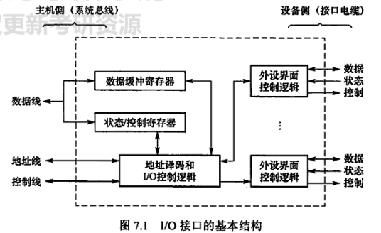
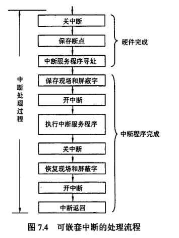
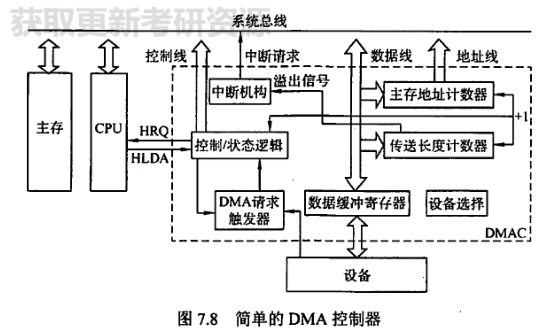

>这部分知识很少，但是若结合其他知识点考察将非常具有综合性，需要注意中断和DMA
# IO接口

IO接口，也叫IO控制器，可以理解为计算机和IO设备的接口(interface)。接口是要完成一系列功能的，主要是接收来自主机的控制信号，以及实现主机和IO设备的信息交换

## 组成

CPU通过内部总线（IO总线，系统总线）与IO接口连接，CPU发来的信号/数据经过IO接口处理(**寻址，命令译码**)传送给IO进行执行

- 数据寄存器：用于暂存从CPU/IO设备传送过来的数据
- 控制寄存器：用于暂存从CPU送来的控制信号
- 状态寄存器：用于暂存IO设备的状态
- 地址译码和IO逻辑：地址译码用于确定IO设备；IO逻辑要完成命令译码，并发送到相应的外设接口，并且要能收集外设状态到状态寄存器
- 外部接口：IO接口与外设的控制界面

## 类型

- 并行接口，串行接口
- 中断接口，程序查询接口，DMA接口
- 可编程接口，不可编程接口

## IO端口

IO端口指的是IO控制器中的寄存器

IO端口想要被CPU访问，则必须要进行编址，有两种编址方式

- 存储器统一编址
- 独立编址

# IO方式
>IO方式是IO的重点和难点，重点要掌握IO中断和DMA，408对于中断的考察尤其细节
## 程序查询方式

程序查询方式也叫轮询方式，指的是CPU等待IO的过程中不断查询IO的状态（状态寄存器），直到IO就绪。

这种方式简单，但是浪费CPU资源

## IO中断方式
>中断要掌握的内容由：中断隐指令，中断处理过程，多重中断，中断屏蔽和优先级

中断的概念在CPU一章中已经有了详细的叙述，本章着重叙述中断处理的过程

### 程序中断方式的过程

- CPU启动外设，之后转向执行当前程序
- 当IO完成数据准备，则发送**中断请求信号**
- CPU可以响应中断的条件下(开中断，指令执行结束)，则终止当前的程序，由**中断向量形成机构**形成**中断向量地址**，引出**中断服务程序**
- 在中断服务程序完成一次数据传送**一次一个字**，之后便返回源程序

#### 中断请求

一个计算机中有许多中断源，为了区分不同的中断源，要对每个中断源进行编号，为此设置**中断请求标记触发器**$INTR_i$

中断请求信号分为可屏蔽中断INTR和不可屏蔽中断NMI

可屏蔽中断可以被**关中断**屏蔽，在关中断状态下无法被响应；不可屏蔽中断和**异常**通常是需要被紧急处理的事件，不可被屏蔽

#### 中断响应优先级

当多个中断源同时发出请求，由中断判优逻辑确定响应哪个中断源的请求，中断响应的判优由硬件排队器实现

>注意区分响应优先级和处理优先级，响应优先级由排队器固定，不可变动，处理优先级由中断屏蔽技术中断屏蔽字来决定，以实现多重中断

#### 中断响应过程

中断响应过程即中断隐指令，包括：

- 关中断：在保存端点和现场的过程中不能响应其他高级的中断，故要进行关中断屏蔽其他中断，以实现**原子操作**
  >原子操作是操作系统的用于，指的是计算机中不可被分割，一气呵成完成的操作，常见的原子操作有关中断，TSL指令，PV原语等
- 保存断点：为了保证中断服务程序结束后能回到原来的程序，要保存PC和PSW的内容。
  
  >注意区别"现场"和"断点":现场是**指令可直接访问**的信息，如ACC，通用寄存器，状态寄存器，通常直接压入栈中；断点是**指令不可访问**的信息，通常由中断隐指令保存在指定的栈和寄存器中，由硬件完成。
  中断隐指令并不是一种指令，而是由**硬件**完成的一系列过程

- 引出中断服务程序：识别中断源后，要将对应的中断服务程序送入程序计数器中，有程序查询法和中断向量法，重点讨论**中断向量**

#### 中断向量

何为向量？即为有方向的量。向量有起点也有终点；**中断向量**的"起点"是我们常说的**向量地址**，向量地址指定了中断向量所在的地址，中断向量的"终点"也就是指向的是**中断服务程序**，总而言之，**中断向量是中断号指向中断服务程序入口地址的向量**

通常所有的中断向量被存储在存储器的某个区域中，称为**中断向量表**

引出中断服务程序时，由中断源通过**中断向量地址形成部件**得到向量地址，再由向量地址查询中断向量表得到中断向量，由中断向量即中断服务程序入口地址得到中断服务程序。

### 中断处理过程

>恢复现场是在中断返回前，将寄存器的内容恢复到中断处理前的状态，由中断处理程序完成

### 多重中断和中断屏蔽技术

多重中断是指CPU执行中断服务程序的时候又出现了**更高优先级**(处理优先级)的中断请求，CPU暂停现有中断服务程序转而响应新的中断请求

实现多重中断的条件如下：

- 在中断服务程序前设置开中断，以便cpu能接收并响应其他中断源的请求
- 优先级高的中断源有权中断优先级低的中断源
>此处的优先级指的是处理优先级，可通过**中断屏蔽技术来实现**

中断屏蔽技术主要是为每个中断源设置**中断屏蔽触发器**，所有中断屏蔽触发器的标志称为**中断屏蔽字**，存放在屏蔽字寄存器中。在屏蔽字中每个中断源都代表了一位，1表示屏蔽该中断源，0表示可以响应该中断

## DMA方式
>DMA要掌握的是DMA的传送过程，传送特点，传送方式，以及DMA控制器的结构

DMA(Direct Memory Access，存储器直接存取)，顾名思义，是允许存储器之间直接交换数据，而不通过CPU，避免了中断方式频繁的占用CPU造成的处理机浪费。DMA方式一次传送**一块**，一字一字传送。

DMA方式常用于**块设备**，如磁盘，显卡，声卡，网卡等高速设备的数据传送。

DMA与中断的联系：DMA控制中也需要中断，但是仅限于**故障和传送结束**：当DMA传送结束后，由DMA控制器向CPU发出DMA中断；DMA和中断类似的是，DMA也需要**预处理和后处理**

### DMA控制器

- 主存地址寄存器：指示要读/写的贮存地址
- 传送长度寄存器：指示传送数据的长度，每传送一个字便+1，当**溢出**时(即一次DMA传送结束后)便向**中断机构**发送**溢出信号**，之后由中断机构向CPU发出**DMA中断请求**。
- 数据缓冲寄存器：暂存每次传送的数据
- DMA请求触发器：IO准备好数据后，发送一个控制信号，使DMA请求触发器置位
- 控制状态逻辑：指定传送方向，修改传送参数，对DMA请求，CPU响应进行协调和同步
- 中断机构：当一个数据块传送完毕后触发(由传送长度寄存器)，向CPU发送中断请求

DMA过程中，DMA占用总线，CPU不被允许访存；DMA结束后，CPU重新获得总线控制权

### DMA传送方式

这部分讨论的是CPU和DMA有冲突时如何解决，主要是DMA和CPU争用总线的控制权

- 停止CPU访存：IO有DMA请求，由DMA控制器向CPU发送停止信号，使CPU脱离总线，停止访存；数据传送结束后，通知CPU可以访存
- 周期挪用：周期挪用有三种情况；IO设备一次挪用**若干存取周期**，**传送完一字**则放弃总线控制权，**单字传送**
  1. CPU正在访存时，不能占用总线
  2. IO和CPU同时请求访存，则IO优先访存
  3. CPU不在访存，IO可访存
- 交替访存：CPU工作周期比存取周期长，把CPU工作周期分为两部分，一部分供CPU访存，一部分供IO访存

### DMA的传送过程

#### 预处理

预处理是DMA的准备工作。

1. 首先CPU执行IO指令，初始化DMA的有关寄存器值，传送方向和启动设备；
2. IO准备好数据，IO设备向DMA控制器发送DMA请求，DMA向CPU发送总线请求(统称为DMA请求)
>CPU对DMA请求的响应可以放在任何一个机器周期的结束
#### 数据传送

DMA一字一字传送，一次DMA传送一块，完全由DMA控制器控制

#### 后处理

DMA控制器发送中断请求，DMA中断服务程序包括检验数据，测试出错，以及是否需要使用DMA.

### 和中断的区别