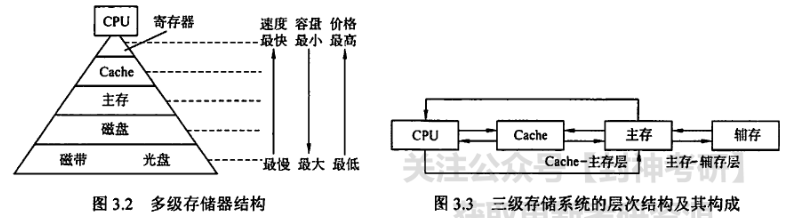
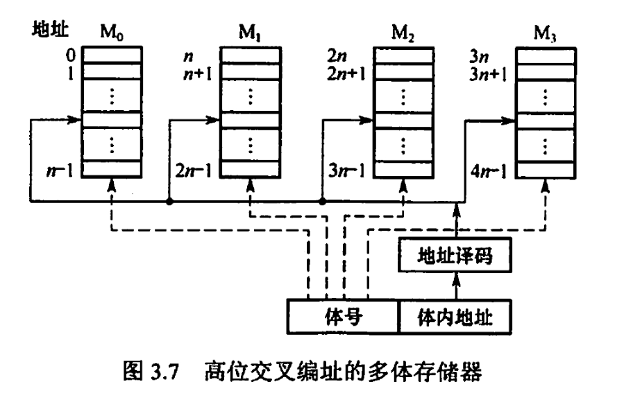
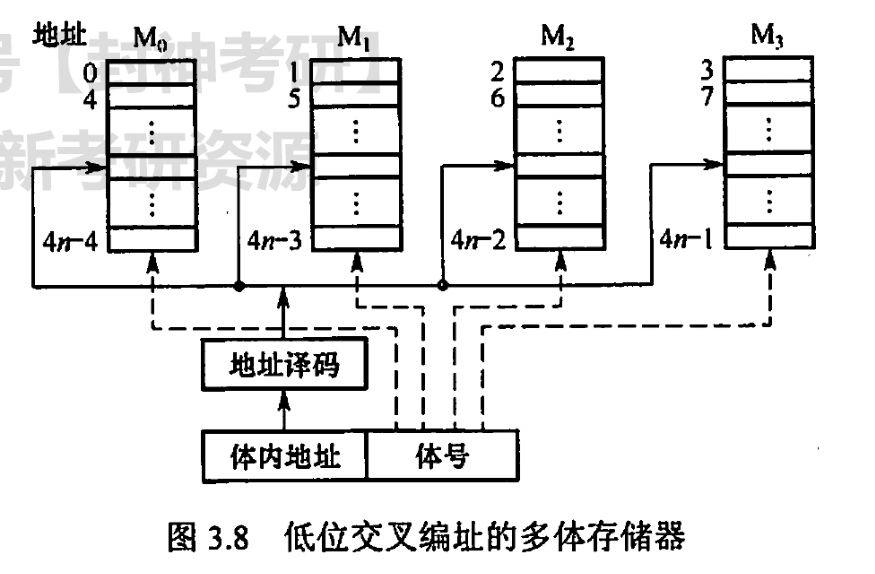
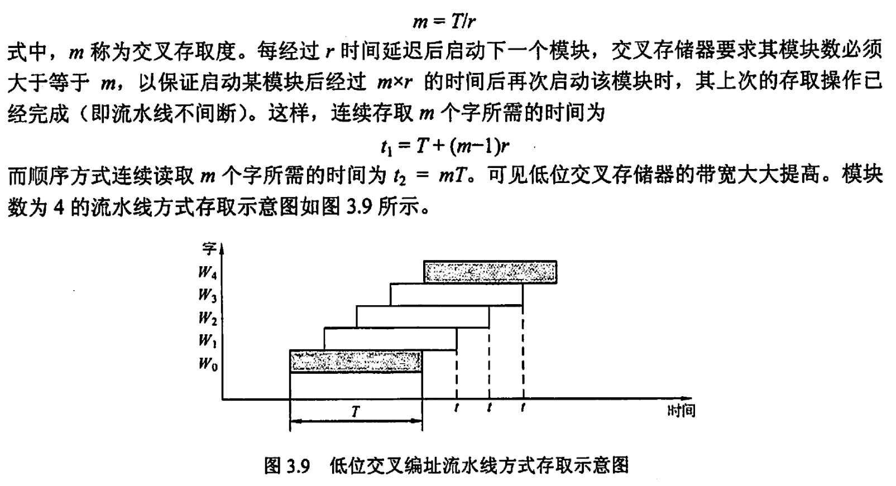
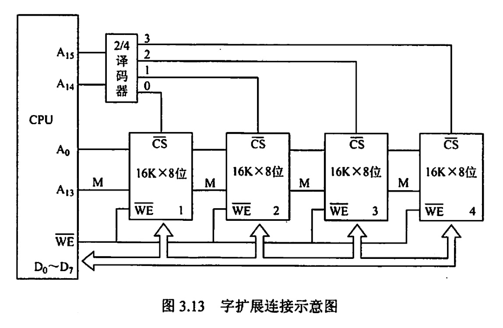
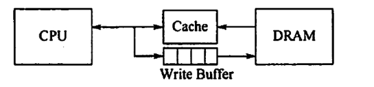

# 概述
>主存是408必考的高频考点，特别是操作系统和计算机组成都对主存有所涉及，只是OS和机组所侧重的方面不同。OS涉及较多的以分页思想提高主存的效率，而机组侧重的是以存储系统的体系架构如cache，虚拟存储器等提高存储系统的效率
## 分类

### RAM

RAM（Random Access Memory，随机存储器）任何一个存储单元都可以随机存取，RAM采用按地址存取的方式，因而与物理位置无关
RAM分为DRAM和SRAM（看第二节）
### ROM

ROM（Read Only Memory，只读存储器）只能随即读出但不能写入，随机存储器的内容不因为断电而丢失。ROM有许多用法，计算机中最重要的ROM是BIOS（Basic Input/Output System，基本输入输出系统），他是计算机开机后最先读取的软件，它执行硬件自检和系统引导。

同样的也衍生出了可重复读写的类型

### cache

位于主存和CPU之间的缓存，用于存放CPU近期使用的指令和数据。Cache的速度通常与CPU相匹配，现代计算机将cache制作在CPU中

>在主存系统的所有组成部分都可以看成是上层存储和下层存储的缓存，如cache是在寄存器和主存之间的缓存。这种缓冲的设计思想，是为了以更小的成本代价提高主存和计算机的效率和存储器，解决CPU之间速度不匹配的问题

### 辅存

辅存常用于存储与计算机正常运行无关和目前未使用到的数据。辅存的内容只有被调入主存中才能被CPU访问

辅存的特点是容量大，价格低，速度慢。CPU是不可能和辅存直接通信的，要通过主存系统实现CPU对辅存数据调入，修改等

>我们打开一个exe文件，计算机在背后做的事情是非常多的，如调页，创建进程（以及PCB）

## 性能指标

### 存储容量

存储容量=存储字数$\times$字长（如$1M\times 8$位），存储字数表示存储器的地址空间大小，字长表示一次存取操作的数据量

### 存储速度

存取周期=存取时间+恢复时间

数据传输率（主存带宽）=数据宽度/存储周期

存取周期和存取时间不同，因为对于任何存储器，读写操作后总是有一段恢复内部状态的恢复时间。对破坏性读出（DRAM），存取周期比存取时间大得多，甚至可以大一倍。因为DRAM读出后需要马上进行再生

## 存储器系统

主存和cache之间的数据调动是硬件完成的，主存和辅存之间的数据调动由硬件和OS共同完成
# 主存储器

## 存储元，存储单元，存储芯片

存放一个二进制比特的物理期间叫存储元，存储元是主存系统的最基本构件，比如双稳态触发器（RAM）和栅极电容（ROM）。

若干存储元构成存储单元，若干存储单元构成存储体（存储芯片）

## RAM

### SRAM

SRAM存储器由双稳态触发器构成，由六个MOS管构成，因此SRAM是非破坏性读出存储器，不需要刷新，恢复时间较短，故存取速度快

但由于触发器体积大，导致集成度低，功耗大，成本高

一般用于Cache

### DRAM

DRAM由栅极电容构成。DRAM只有一个晶体管，故DRAM的体积小，集成度高，价格低，但存取速度慢

由于电容中的电荷只能维持1-2ms，DRAM中的数据会自动消失故DRAM要进行定期进行刷新，通常取2ms，称为刷新周期

- 集中刷新：一个刷新周期内，利用固定的时间对全部存储单元进行刷新，称为“死区”，在死区不能访问存储器，降低效率
- 分散刷新：把每行的刷新分散到各个工作周期。但加长了系统的存取周期，降低效率
- 异步刷新：在存取周期内对每行各刷新一遍，减少了死区时间，且充分利用了2ms的刷新周期

刷新过程由存储器独立完成，利用CPU不访存的时间进行，刷新按**行**刷新

## ROM

ROM是非易失存储器，下表是各种ROM的特点

|ROM|特点
:-:|:-:
MROM（掩模式只读存储器）|芯片生产时写入数据，不可更改
PROM（一次可编程ROM）|允许用户用编程器写入数据，只能写入一次
EPROM（电可擦除可编程ROM）|可以对数据进行多次读写，但编程次数有限
Flash存储器|断电时保存数据，写入时要擦除再写入，写比读慢
SSD|实际上是flash芯片组成，速度快，价格高

## 主存系统

### MDR和MAR

MDR（Memory Data Register，存储器数据寄存器）用于暂存读出/写入存储器的数据，因此MDR的位数和数据线宽度相同，也和存储字长相同

MAR（Memory Address Register，存储器地址寄存器）用于存储CPU送来的地址信息，以便进行随机存取。MAR的位数和地址线宽度相同，等于存储单元的个数

### 片选

由于一个存储芯片的容量有限，通常要将存储器进行扩展，通常来说字扩展需要片选（chip selection，$\bar{CS}$）。

### 译码器

用于将地址信号翻译成存储单元的选择信号

### 存储体

### 读写控制信号

完成读写操作

### 存储器引脚

- 地址线：存储单元个数N->$\log_2{n}$
- 数据线：存储字长
- 读写线：1（WE）或2（WE,OE）
- 片选线：1
- 供电引脚，接地引脚
- 注意地址线复用技术，行地址和列地址通过相同的引脚两次输入，引脚数可减半。若地址线过多，要考虑地址线复用。注意SRAM不采用地址复用技术

## 寻址方式

### 按字节

### 按字

## 多模块存储器

### 单体多字

一个存储器只有一个存储体，每个存储单元存储m个字，总线宽度也为m个字，一次并行读出m个字

### 多体并行高位交叉

多体并行存储器是由多个相同容量和存取速度的模块组成的，既能并行操作，又能交叉操作

并行操作指的是同时访问多个模块，同时启动，同时读出

所谓高位交叉指的是模块号在高位而体内地址在低位的结构。连续的地址块是在一个存储模块内的，如图所示，当连续访问主存时，都是优先在一个模块中访问，等该模块访问完才转到下一个模块。高位交叉并不能实现并行操作，只是扩展了存储容量

### 多体并行低位交叉

低位是体号，高位是体内地址。每个模块按模m交叉编制，如图所示。连续的地址块顺序存放到不同的存储模块内。

低位交叉编制存储器是按流水线方式工作的，设模块存取一个字的存取周期为T，总线传送周期为r，存储器交叉模块数应大于等于**m=T/r**

# 主存储器和CPU连接

## 存储器扩展

存储器扩展是为了充分利用CPU的地址总线和数据总线

### 位扩展

位扩展是对存取字长进行扩展，使数据位数和CPU数据线数相等。

位扩展的方法是：多个存储单元的地址线，读写控制线和片选线并联，数据端分别引出

如8个8kx1位的存储单元组成8kx8位的存储器，每个存储单元的数据线作为CPU数据线的一位

### 字扩展

字扩展是对存储字数进行扩展。

字扩展的方法是：多个存储单元的地址线，数据线，读写控制线并联，利用片选线区分各芯片的地址范围。

通常用CPU地址线的高位的**全部或者部分**作为片选信号，经过译码器译码后选择一路芯片。同一时间只有一个芯片被选中。

- 芯片1，地址范围0000H~3FFFH
- 芯片2，地址范围4000H~7FFFH
- 芯片3，地址范围8000H~BFFFH
- 芯片4，地址范围C000H~FFFFH

### 字位同时扩展

存储单元（16kx4位）经过位扩展后作为一组存储单元组（如16kx8位），然后将若干组存储芯片经过字扩展（如64kx8位）。每个片选信号选择一组存储单元（经过位扩展后的存储单元组）

## CPU与主存连接

CPU的访存控制信号MREQ（低电平有效），有效时才进行片选

# Cache
>重点
## 局部性原理

### 空间局部性

最近的未来要用到的信息，很可能是现在正在使用的信息在存储空间上是邻近的

典型应用：cache，数组访问

### 时间局部性

最近的未来要用到的信息，很可能是现在正在使用的信息

典型应用：循环体语句

## cache工作原理

Cache（高速缓冲存储器），通常由SRAM组成。

由于主存采用分页技术，为了方便cache交换信息，故cache也被划分为Cache行，大小和主存的块是一样的。cache和主存的信息交换以块为单位，而与CPU的信息交换以字为单位。

由于cache的容量远小于主存，故cache仅保存根据局部性原理所需要的最活跃的块。

1. CPU发出读请求，若cache读命中，则通过地址转换机构将地址转化为cache地址，直接读取cache，与主存无关
2. 若不命中，则访问主存，并将所读内存块调入cache
3. 调入过程cache很可能已满，则根据某种替换算法（LRU，FIFO，RANDOM，etc.）替换cache中某行。
4. CPU发出写请求，若写命中，则会导致cache内容与主存内容不一致。根据一定的写策略，如全写法或写回法，具体见后文

命中率：CPU与访问的信息已在Cache中的比率

$H=\frac{N_c}{N_c+N_m}，N_c为总命中次数，N_m为访问主存次数$

Cache-主存系统的平均访问时间为

$T_a=Ht_c+(1-H)t_m,t_c为命中时访问时间，t_m为未命中时访问时间$

块长与命中率是有一定关系的，在一定范围内，块长越大命中率越高，但高过某个数值则命中率降低。

块长的最优值为4~8个编制单位，或一个存取周期所能调出的字节长度

## cache与主存地址映射

>cache与主存映射是cache部分的重要考点，本部分按照地址映射，工作模式，优缺点展开

地址映射指的是将主存的地址映射到cache的地址。由于cache行数比主存块数少，因此在cache中要给每个主存块加一个标记，指明**cache行是主存中的哪一块的副本**。为了说明cache是否有效,每个cache行要有一个有效位

cache命中的充分必要条件是**标记位匹配且有效位位1**

### 直接映射

首先我们要掌握的是，由于主存采用分块存储，因而主存的地址空间被划分位(主存块号，块内地址)

直接映射中，主存地址被划分为(标记，cache行号，块内地址)，即主存块号被划分位标记和cache行号。若主存块数为$2^m$,cache行数为$2^c$，则cache行号位数为c，标记位数为m-c

直接映射方式主存的每一块只能装入cache中的唯一位置，若调入时该位置有内容，则**无条件替换**。由于cache中有许多其他的地址空着也不能使用，导致直接映射冲突率高

在直接映射方式中，访存过程如下：

- 根据cache行号，找到对应cache行，提取标记
- 比较标记，并检查有效位，命中则访问块内地址对应单元
- 不命中，则访存，**直接替换cache行的内容，无需替代算法**

直接映射速度最快，但是替换频率高，空间利用率最低

### 全相联

全相联方式，主存地址被划分为(标记，块内地址)，即全相联映射的标记和主存块号是一致的，故主存中每一块可以存放到cache的任何位置，标记位指出该行取自主存的哪一块，访存时要和cache行的标记进行比较。

全相联映射空间利用率高，命中率快，但是比较标记位的速度较慢，常用相联存储器进行地址映射，成本高

访存过程：
- 取主存地址前m位对比cache标记(按内容寻址，相联存储器)
- 命中则访问块内地址对应单元
- 不命中，则访问主存，运行替换算法

### 组相联

组相联结合了直接映射和全相联。将Cache分为Q个大小相等的组，组间直接映射，组内全相联。即每个主存块都对应唯一的cache组，在组内主存块可以存放到任何位置

r路组相联的意思是一个组内有r个大小相等的组

组相联映射将主存地址分为(标记，cache组号，块内地址)

访存过程：

- 根据主存地址中的组号，找到cache相应分组
- 在cache组中对标记位进行内容匹配（
- 命中则访问块内地址对应单元
- 不命中，则访问主存，运行替换算法

组相联结合了直接映射和组相联的优缺点，既有直接映射的低成本，又有全相联映射的性能

### cache行所包含的信息

- 有效位：1位，标识cache行是否有效
- 标记位：根据映射方式决定，用来指明cache行的字是否是所请求的字
- 脏位：用于回写法，1位，表示cache行是否被修改
- 计数位：用于LRU算法，$2^n个cache行要n位计数位，对于组相联，r路组相联需要\log_2{r}位计数位$，用于选择替换的块

## cache替换算法

- 随机算法：每次选择随机cache块，这种算法命中率较低
- FIFO算法：选择最早调入的cache块替换出，但也未根据局部性算法，造成抖动现象
- 近期最少未使用算法（LRU）：最常考，选择近期最久未访问过的cache行作为替换的行。为了实现LRU，需要在cache行内设计**计数位**。
  $2^n个cache行要n位计数位，对于组相联，r路组相联需要\log_2{r}位计数位$。

实际手算时只需要把最久未调动的cache块换出即可

当集中访问的存储区大小超过cache组的大小时，命中率会变得很低，这种现象叫抖动

## cache写策略

写策略分为两个方面，当cache写命中（即要写入的数据在cache内），有两种方式

- 全写法（写直达法）：写命中时，将数据同时写入cache和主存。使用写直达的机制，每次写操作都要把数据写入主存之中，这些写操作将花费大量的时间。故设置一个写缓存，当一个数据写入主存时，先写入写缓冲中，写缓存再控制内容写入主存。
  
- 写回法：写命中时，只写入cache，不写入主存。这会导致cache和主存的数据不一致。故给每个cache行设置一个脏位，用于表示cache是否被修改（是否和主存原件不一致）

当cache写不命中时，有两种方式

- 写分配法：加载主存块到cache中，然后更新这个cache块。
- 非写分配法：只写入主存，不写入cache

写分配法和写回法配合，非写分配法和全写法配合

## 多级cache和分离cache

多级cache：L1cache，L2cache，L3cache，离CPU越远，速度越慢

各级cache之间用全写法，cache和主存之间用写回法

分离cache：指令cache和数据cache，用于指令流水线，指令cache和数据cache常放在L1cache

# 外存

## 磁盘存储器

### 磁盘的组成

- 磁盘驱动器：核心部件是磁头组件和盘片组件，如温切斯特盘
- 磁盘控制器：磁盘存储器和主板的接口，如IDE，SATA，SCSI等

### 磁盘的区域划分

- 磁道：一个盘面按半径划分位若干磁道
- 柱面：不同盘面的相同编号磁道构成一个磁头
- 盘面
- 扇区：每个磁道划分为若干扇区，扇区是磁盘IO的最小单位，即磁盘按块存取。每个扇区存储比特数相同，故密度不同

## 性能指标

### 记录密度

- 行密度是**半径方向单位长度上磁道数**
- 位密度是磁道单位长度上能记录的二进制比特数
- 面密度是行密度*位密度

### 容量

- 非格式化容量：理论上可容纳的数据量
- 格式化容量：按照某种记录模式所能存储信息的总量

### 平均存取时间

平均存取时间=寻道时间+旋转延迟时间+传输时间

- 寻道时间：磁头移动到目的磁道所需的时间，取平均值
- 传输时间：传输数据所需时间
- 旋转延迟时间：磁头定位到目的扇区所需时间。平均旋转延迟默认为转半圈时间，由转速可知

## 地址映射

（柱面号，盘面号，扇区号）

## 磁盘阵列

RAID（独立冗余磁盘序列）将多个独立的物理磁盘组成一个独立的逻辑盘

- RAID0：无冗余和无校验的磁盘阵列
- RAID1：镜像磁盘阵列
- RAID2：采用纠错的海明码的磁盘阵列

有关磁盘调度算法和磁盘管理，具体见操作系统部分

## SSD

SSD是基于闪存的存储器，和U盘没有本质的区别

SSD重复写次数过多会导致闪存块磨损。但是经过磨损均衡处理，SSD的平均年龄较长

具体见操作系统

