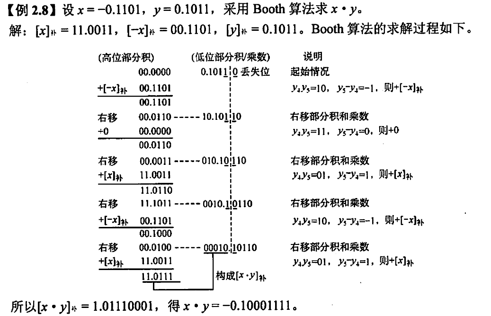

# 进制之间转换

不用多说

# 数据的表达形式

## 原码

最高位表示符号，剩余位表示绝对值

假设字长为n+1位，则可以表示$-2^n+1\le x\le2^n-1（整数）,-(1-2^{-n})\le x\le(1-2^{-n}) (小数)$

注意，原码0有两个表达形式，即100000...和000000...

原码表示简单直观，但是加减运算比较复杂，且零有两种形式

## 反码

反码是将原码每位取反得到的，通常是作为原码和补码转换的中间表示

## 补码

正数的补码等于原码，负数的补码等于反码末位加1

原码:1,1011001

反码:1,0100110

补码:1,0101111

可以看出，负数补码从最右边的1记起，左边的部分和反码一致，右边的部分和原码一致，即**高位和反码一致，低位和原码一致**这个特性在移位运算中特别有用

补码相对于原码而言，1,00000表示最小的负数$-2^5$,补码的表示范围为$-2^{n}\le x\le2^{n}-1或-1\le x\le1-2^{-n}$由此可知为什么c语言中int的负数最小值的绝对值比正数最大值多1

$[x]_{补}\rightarrow [-x]_{补}$:符号为和数值位全部取反末位加1

对于负数而言，数值部分绝对值越大，绝对值越小，真值越大

如：1,0111011和1,1111001,前者转化为真值-69，后者转化为真值为-7

## 移码

移码用于浮点数阶码，只能表示整数。移码是在真值的基础上加上一个偏移量得到的。移码保持了数据原有的大小顺序

移码等于补码符号为取反

移码具体放在浮点数中具体叙述

## 编码之间转换

编码(n+1位)|最小值|最大值|零
:-:|:-:|:-:|:-:
原码带符号|1,1111...=$-(2^{n}-1)$|0,1111....=$2^n-1$|1,0000....;0,0000....
补码带符号|1,0000...=$-2^{n}$|0,1111....=$2^n-1$|0,0000....

# 移位运算

移位运算总结如下表

-|编码|添比特
:-:|:-:|:-:
正数|补，原，反|0
负数|原|0
负数|反|1
负数|补|左移添0,右移添1(由于补码高位和反码一致，低位和原码一致)

## 循环移位

循环移位的特点是移出的数位又被移入数据中，循环移位也分为带进位和不带进位

循环移位适合将高位数据和低位数据互换

# 加法

> 加法是计算机中四则运算的基础，所有四则运算都转化为加减运算和移位运算的组合
## 运算器

这部分内容是有关CPU的运算器的，涉及较多底层硬件内容，暂且不关注

我们主要关注加法运算电路所产生的四个程序状态字标识符:

- ZF,零标识符，顾名思义，结果为0则ZF=1
- OF,overflow flag,溢出标识符，表示**带符号**整数运算出现溢出，对无符号数没有意义
- SF,sign flag，符号标识符，即F的最高位，对无符号数没有意义
- CF,carrying flag，进位标识符，表示无符号数运算时产生的进位/错位，判断是否溢出。对符号数没有意义

## 运算方法

通常进行补码加减法：$[x+y]=[x]+[y],[x-y]=[x]+[-y],[x]代表x的补码$

- 符号位参与运算
- 最高位丢弃，保留n+1位
- 运算结果为补码

如：$x=15,y=24$,求$[x+y]_{补},[x-y]_{补}$

$
[x]_{补}=00001111，[y]_补=00011000,[-y]_补=11101000\\\
[x+y]_补=00100111,[x-y]_补=[x]_补+[-y]_补=11110111
$
## 溢出判断

只有带符号数进行运算时才会出现溢出，且出现溢出的情况一定是**正+正=负->上溢或负-正=负+负=正->下溢**

判断运算溢出最基本的方法是人工带入真值进行运算，若超出补码范围则必然发生溢出

而计算机由三种方法可以检验溢出

- 单符号位：由于溢出的两种情况**正+正=负->上溢或负-正=负+负=正->下溢**，可知溢出发生时运算结果的符号位和两个运算数的符号位相反，得到判别逻辑式$(A_sB_s\oplus S),A_s,B_s$为运算数A，B的符号，S为运算结果的符号
- 双符号位(变形补码)：首先说明的是，变形补码只存储一个符号位，当要用到第二个符号位时便复制一份符号位。一般的变形补码两个符号位相同，当出现溢出时，就会有两个符号位不同的情况：
  1. 两个正数运算时发生正溢出，必然是<u>00,1....+00,1....</u>的情况，在这个情况下便会得到结果为01,.....的数，故发生正溢出的符号位$S_1S_2=01$,
  2. 两个负数运算时发生正溢出，必然是<u>11,1/0....+11,0...</u>的情况，在这个情况下便会得到结果为10,.....的数，故发生负溢出的符号位$S_1S_2=10$,
  3. 高位符号表示运算结果真实的符号，低位符号表示运算结果实际的符号，两个符号位不同则发生溢出
- 采用一位符号的进位$C_s$和最高数据位$C_1$的进位判断：其实是前两种方法的结合

# 乘除运算

> 乘法运算由累加和右移组成,除法运算由累加和左移组成，这一块内容要多感受例题

## 原码一位乘

算法思想:

- 符号位单独运算
- 部分积是乘法运算的中间结果，每次$x\times y_i$的值与前面结果累加就是部分积
- 从乘数的最低位开始判断，若$y_i=0$，则部分积乘0右移一位，若$y_i=1$,则部分积$+|x|$然后右移一位(移位是逻辑移位)
- 共进行n次循环，用双符号位进行运算
  

## 补码一位乘（booth算法）

乘数末尾添加一个附加位，由附加位和低位的取值决定运算

- 符号位参与运算
- 采用双符号位
- 乘数末尾添加附加位$y_{n+1}$初值为0
- 根据($y_n,y_{n+1}$)取值来判断操作：
  1. 若$y_n=y_{n+1}$只进行右移位
  2. 若$y_n-y_{n+1}>0$部分积$+[-x]_{补}$,右移
  3. 若$y_n-y_{n+1}<0$部分积$+[x]_{补}$，右移
  4. 移位按补码移位规则进行
- 进行n+1步运算，但n+1步时不进行移位,只根据$(y_n,y_{n+1})$决定运算

## 加减交替法

- 符号位单独运算
- 先用被除数减去除数$x-y=[x]+[-y]$
  1. 余数大于0,商1，商和余数左移，减除数
  2. 余数小于0,商0，商和余数左移，加除数
- 第n+1步余数为负，加上除数得到正确的余数

# 强制类型转换

## 符号拓展

符号拓展是两个不同位的定点带符号数相加时进行的，比如8bit数和32bit数相加时候要将8bit数拓展为32bit数

正数符号拓展高位添0

负数原码符号拓展高位添1，补码添1（整数部分）或0（小数）

## 浮点数强制类型转换

# 浮点数

## 浮点数表示

### 组成

### 尾数规格化

# IEEE 754

## 组成

## 真值

## 特殊情况

# 浮点数加减法

### 对阶

### 规格化

### 舍入

### 溢出判断

