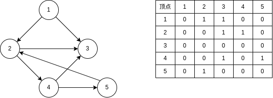
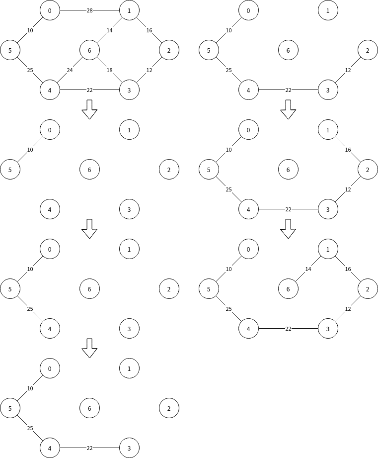
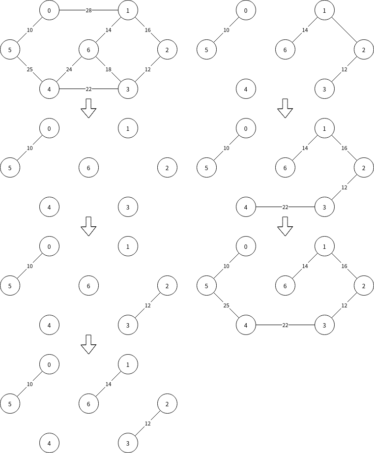
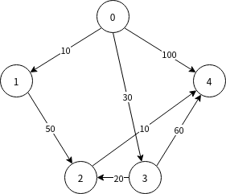
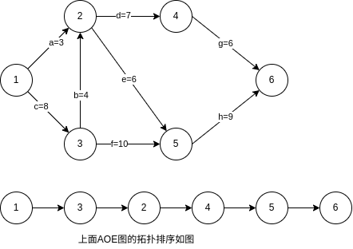

# 图

## 存储结构

### 邻接矩阵

用二维矩阵$edge[][]$存储图的边，$(v_i,v_j)$或$<v_i,v_j>$存在，则$edge[i][j]=1$

~~~c
typedef struct{
    char vex[MAXVERTEXNUM];//顶点表
    int edge[MAXVERTEXNUM][MAXVERTEXNUM];//边表，邻接矩阵
    int vexnum, arcnum;//顶点数，边数
}Mgraph;
~~~

邻接矩阵有一些很重要的特性:

* 无向图的邻接矩阵是对称矩阵，故可以压缩存储
* 对于有向图，第i行表示顶点i发射出去的弧，第i列表示指向顶点i的弧
* 空间复杂度$O(|V|^2)$适合存储稠密图
* 邻接矩阵唯一
* 寻找所有的边要遍历整个矩阵，时间开销大

### 邻接表

邻接表用顶点表存储顶点，每个顶点都连接到一个单链表，单链表保存依附于该顶点的边（对于有向图而言是**出边**）

~~~c
typedef struct ArcNode{//边表，邻接边链表
    int adjVex;//保存该边所连接到的顶点
    struct ArcNode* next;//指向下一条邻接边的指针
}ArcNode;

typedef struct VexNode{//顶点表
    char vexinfo;//顶点信息
    ArcNode* firstArc;//指向第一条依附于该节点的边
}VexNode, AdjList[MAXVERTEXNUM];

typedef struct{
    AdjList vertices;//邻接表
    int vexnum, arcnum;
}
~~~

* 无向图的邻接表空间复杂度为$O(|V|+|E|)$,有向图的邻接表空间复杂度为$O(|V|+2|E|)$
* 适合存储稀疏图
* 寻找有向图的入度或入边比较麻烦
* 邻接表不唯一

## 下文算法中常用的两个操作

~~~c
int FirstNeighbor(g,v);找到v的第一个邻接顶点
int NextNeighbor(g,v,w);找到v相对于w的下一个临界顶点
~~~

## 图的遍历

>图的遍历是图算法的基础，在21年的408中已经考查了图的算法题，基于计算机图形学，深度学习，人工智能的流行，图的遍历进入408的考题中也是指日可待，**必须掌握到能熟练写出的程度**

图的遍历算法中，我们循环访问一个节点的邻接顶点，故有可能出现**遍历环**的情况，为此我们要设置一个$visit[][]$数有向图

### 图的广度优先遍历

bfs算法，与树的层序遍历是类似的，同样我们需要构造一个**辅助队列**，用来记忆当前正在访问顶点的下一层顶点

~~~C
bool visited[MAXVERTEXNUM];//visit数组
void BFSTraverse(Graph g){//bfs主算法
    for(int i = 0; i < g.vexnum; i++){
        visited[i] = 0;//初始化visited数组
    }
    for(int i = 0; i < g.vexnum; i++){//遍历每个顶点
        if(!visited[i]){//对每个连通分量进行遍历
            bfs(g,i);//从i开始遍历图g
        }
    }
}
void bfs(Graph g, int i){
    visit(i);//访问顶点i，可自定义
    InitQueue(q);//辅助数组
    visited[i] = 1;//修改访问标志
    enqueue(q,i);//初始节点入队
    while(!isEmpty(q)){
        dequeue(q,i);//队头元素（当前要访问的元素出队）
        for(int j = FirstNeighbor(g,i); j>=0; j = NextNeighbor(g,i,j)){
            //遍历节点i的邻接结点
            if(!visited[j]){//j顶点未被访问过
                visit(j);
                visited[j] = 1;
                enqueue(q,j);/顶点j入队
            }
        }
    }
}
~~~

#### 算法效率

需要一个辅助队列和visited数组，空间复杂度为O(|V|)

采用邻接表存储，查找每个顶点的邻接点所需时间为为$O(|E|)$共需查找$O(|V|)$次，故时间复杂度为$O(|V|+|E|)$

采用邻接矩阵存储，查找每个顶点的临界点所需时间为$O(|V|)$共需查找$O(|V|)$次，故时间复杂度为$O(|V|^2)$

### 图的深度优先遍历

图的深度优先遍历类似于树的先根遍历，因此也用递归来实现

~~~c
bool visited[MAXVERTEXNUM];
void dfs(Graph g){
    //dfs主算法部分与bfs是一致的
    for(int i = 0; i < g.vexnum; i++){
        visited[i] = 0;//初始化visited数组
    }
    for(int i = 0; i < g.vexnum; i++){//遍历每个顶点
        if(!visited[i]){//对每个连通分量进行遍历
            dfs(g,i);//从i开始遍历图g
        }
    }
}
void dfs(Graph g, int i){//顶点i出发，遍历图g
    visit(i);
    visited[i] = true;
    for(int j = FirstNeighbor(g,i), j>=0; j = NextNeighbor(g,i,j)){
        if(!visited[j]){
            dfs(g,j);
        }
    }
}
~~~

#### 算法效率

递归实现，需要一个递归工作栈，空间复杂度为O(|V|)

采用邻接表存储，查找每个顶点的邻接点所需时间为为$O(|E|)$共需查找$O(|V|)$次，故时间复杂度为$O(|V|+|E|)$

采用邻接矩阵存储，查找每个顶点的临界点所需时间为$O(|V|)$共需查找$O(|V|)$次，故时间复杂度为$O(|V|^2)$

## 图的应用

>图的应用主要考察各个算法的执行过程，不太可能考察到算法设计题，但是经常考大题，选择题也是年年必考，故图的应用要得到重视。图的应用比如*dijkstra*算法,会结合计算机网络进行考察，但是本质上还是考察数据结构

### 最小生成树算法

在**连通无向图**中，包含**所有节点以及最少的边数**称为生成树

在带权连通图中，对于该图的生成树，其**所包含的边权值和最小**，则称这棵生成树为**最小生成树**(minimum span Tree,MST)

最小生成树有如下特性:

* 边权值和唯一，且为最小
* 生成树不唯一，当且仅当图中任意一环各边权值不等时MST唯一
* 边数=顶点数-1
  
#### prim算法

##### 算法思想

初始时选择一个顶点加入树，之后选择一个与**当前树中顶点集合距离最短的顶点**加入树，直到图中顶点全部加入树

##### 时间复杂度

prim算法要循环找到没加入树且距离树最近的顶点，每轮循环找到顶点后，都会更新最小距离，故时间复杂度为$O(|V|^2)$适用于**边稠密的图**

#### kruskal算法

##### 算法思想

将图中所有边按权值递增的顺序排序，每次循环找到权值最低的边且**边所连接的两个顶点不连通**，直到所有节点加入树

##### 事件复杂度

kruskal算法用二叉堆存放边，找到权值最小的边只需要$O({\log}_2|E|)$，所有边判断连通的过程可以用并查集实现，事件复杂度为$O(|E{\log}_2|E|)$

### 最短路径算法

最短路径，即找到两个顶点之间的最短路径长度和最短路径顶点序列，分为单源最短路径问题和任意两个顶点之间最短路径问题，前者用**BFS**和**Dijkstra**算法实现，后者用**floyd**算法实现

#### BFS无权图

顾名思义，利用BFS按层次遍历的特点，便可求出最短路径，注意仅适用于**无权图**

~~~c
void BFSMinPath(Graph g, int i){
    for(int i = 0; i<G.vexnum; i++){
        d[i] = _INT_MAX_;
        path[i] = -1;
    }
    InitQueue(q);
    enqueue(q,i);
    visit[i] = 1;
    while(!isEmpty()){
        dequeue(q,i);
        for(int j = FirstNeighbor(g,i);j>=0;j = nextNeighbor(g,i,j)){
            if(visited[j]!=0)
                visit[j] = 1;
                path[j] = i;
                dist[j] = dist[i] + 1;
                enqueue(q,j);
        }
    }
}
~~~

#### dijkstra算法 带非负权图

>dij

##### 算法思想

构造两个数组：$dist[]$和$path[]$，$dist[i]$用来保存$<v_0,v_i>$的最短路径长度，$path[i]$用来保存最短路径的直接前驱

初始化，path值全部赋为-1，根据$v_0$的信息初始化dist，将$v_0$加入顶点集，之后进行循环。每轮循环找到一个还未加入顶点集顶点$v_i$到$v_0$的距离最短，并将其加入顶点集。之后循环更新各个节点的最短路径，若满足$dist[j]>dist[i]+Weigh(v_i,v_j)$，则更新其dist值，并且使$path[j]=i$否则不更新

源点|终点|第一轮|第二轮|第三轮|第四轮|路径长度|
-     |-|     -|      -|-|-|-|
0     |1|(0,1)#|       |||10|
&emsp;|2|——    |(0,1,2)|(0,3,2)#||—,60,50
&emsp;|3|(0,3) |(0,3)# |||30
&emsp;|4|(0,4) |(0,4)  |(0,3,4)|(0,3,2,4)#|100,90,60
>表中#表示本轮选中的最短路径

##### 时间复杂度

由算法思想可知Dijkstra算法用到了两层嵌套循环，故时间复杂度为$O(|V|^2)$

**Dijkstra算法不适用于带负权图**

#### floyd算法
>floyd算法运算过于复杂，在408考题内进行运算的可能性不大
运用了动态规划的思想

初始时，对$\forall v_i,v_j$，若他们之间存在边，则以此边上权值作为他们的最短路径长度，否则以$\infty$作为最短路径长度。将这些信息存储在$A^{-1}[][]$中。之后每轮循环，**尝试在源路径中加入顶点k**作为 **“中转站”**，若得到的路径减少了，则更新路径长度，记录在$A^k[][]$中

以$v_{k}$作为中转站，若满足$A^{k-1}[i][j]<A^{k-1}[i][k]+A^{k-1}[k][j]$则更新路径长度

$A^{-1}$|0|1|2|3|4
-|-|-|-|-|-
0||10||30|100
1|||50||
2|||||10
3|||20||60
4||||

$A^{0}$|0|1|2|3|4
-|-|-|-|-|-
0||10||30|100
1|||50||
2|||||10
3|||20||60
4||||

$A^{1}$|0|1|2|3|4
-|-|-|-|-|-
0||10|60|30|100
1|||50||
2|||||10
3|||20||60
4||||

$A^{2}$|0|1|2|3|4
-|-|-|-|-|-
0||10|50|30|70
1|||50||60
2|||||10
3|||20||30
4||||

$A^{3}$|0|1|2|3|4
-|-|-|-|-|-
0||10|60|30|70
1|||50||60
2|||||10
3|||20||30
4||||

$A^{4}$|0|1|2|3|4
-|-|-|-|-|-
0||10|60|30|70
1|||50||60
2|||||10
3|||20||30
4||||

##### 时间复杂度

每轮循环都要遍历矩阵，时间复杂度为$O(|V|^3)$

### 向无环图描述表达式

### 拓扑排序

#### 概念

* 每个顶点出现一次
* 若A在B前面，则不存在从B到A的路径
* 拓扑排序是针对有向无环图而言的，即图中必无环
* 若当前图中不存在无前驱的顶点（即所有顶点入度>0）则拓扑排序失败，图中必有环

#### 实现

借助栈来保存入度为0的顶点，用count指针记录当前已输出的节点数，用print[]数组保存拓扑序列

~~~c
bool topologicalSort(graph g){
 InitStack(s);
 int count = 0;//记录已输出的节点数
 for(int i = 0; i < VexNum; i++){
  if(indegree[i]==0)push(s,i);//入度为0入栈，
 }
 while(!isEmpty(s)){
  pop(s,i);
  print[count++] = i;
  for(p = G.vertices[i].firstarc;p;p=p->nextarc){//邻接表存储，p指向顶点表指针域，即结点i的第一个邻接边
   v=p->adjvex;//v指向p所对应边所连接的顶点
   if(!(--indegree[v])){//从逻辑上删去顶点i于顶点v的边
    push(s,v);
   }
  }
 }
 if(count<Vexnum) return false;
 else return true;
}
~~~

#### 逆拓扑排序及其实现

### 关键路径

AOE网，即用边表示活动的网络。在AOE网中，节点被称为**事件**，边被称为**活动**，其中没有入边的节点称为**源点**，没有出边的节点称为**汇点**，AOE网中**有且仅有**一个源点和汇点

关键路径就是在研究如何计算出从源点到汇点具有最大路径长度的路径

关键在于计算四个值：

事件最早发生事件$ve(k)=源点到事件(顶点)k的最大路径长度$

事件最迟发生时间$vl(k)=ve(汇点)-事件k到汇点的最大路径长度$

**$ve(k),vl(k)$用拓扑排序和逆拓扑排序顺序进行计算**。

活动最早发生时间$e(i)=ve(活动i的源事件)$

活动最迟发生时间$l(i)=vl(i的目标事件)-权值(i)$

若满足$l(i)-e(i)=0$则活动i是关键活动，活动i连接的两个事件是关键路径上的顶点。

**更好地理解关键路径算法而不是单纯的记公式**：

k|1|2|3|4|5|6
--|--|--|--|--|--|--
ve(k)|0|12|8|19|18|27
vl(k)|0|12|8|21|18|27

i|a|b|c|d|e|f|g|h
-|-|-|-|-|-|-|-|-
e(i)|0|8|0|12|12|8|19|18
l(i)|9|8|0|14|12|8|21|18
l(i)-e(i)|9|0|0|2|0|0|2|0

**必须减少所有关键路径上的关键活动的时间才能缩短工期**

#### 关键路径的考试做法

1. 直接求出最短路径，如上图，得关键路径为1->3->2->5->6或1->3->5->6，关键路径长度为27
2. 事件最早发生时间：源点到目标点的最长路径长度
3. 事件最迟发生时间：关键路径长度-目标点到汇点的最长路径长度
4. 活动最早发生时间：活动源点事件的最早发生时间
5. 活动最迟发生时间：活动目标点事件的最迟发生时间-活动所需时间