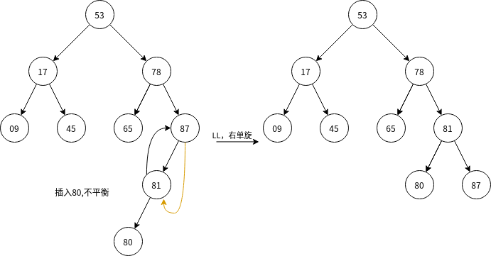

# **查找**

> 查找算法主要分为：**线性表查找，树形查找**，对于本章所列举的所有查找算法都要掌握它的查找过程，对于各种树形查找要关注它的**性质**，要能区别BST，AVL，RBT，B树，B+树之间的区别.**B树，红黑树，平衡二叉树**是本章的难点，这三种树主要考察它们的**插入删除**要进行什么样的操作，而调整的核心问题就在于**保持各种树的性质不变**。**红黑树**是新考点，很有可能在今年的408中考察一题选择题。B树是近年来的高频考点，要重点掌握.408数据结构的考察重点越来越偏向**树，图**这类逻辑结构较为复杂的数据结构和算法，要值得重视.对于**顺序查找**，**二分查找**，**二叉排序树（BST）**，**hash查找**要关注它的平均查找长度**ASL**

​&emsp;&emsp;平均查找长度$ASL=\sum\limits_{i=0}^n p_ic_i$,其中$p_i$为搜索第i个元素的概率，$c_i$为搜索到第$i$个元素所需的查找次数,分析$ASL$时通常取$p_i=\frac{1}{n}$,但实际上并不会可能达到这个概率

&emsp;&emsp;$ASL$分为查找成功和查找失败两种，通常我们利用查找判定树来确定$ASL$

## **顺序查找**

&emsp;&emsp;对于线性表来说，从头到尾遍历线性表，对比每个关键字。

~~~c
void seqSearch(int Elem[], int key){
    Elem[0] = key;//规定：数组元素从1开始存放，ELem[0]作为监视哨，用来控制搜索过程的结束
    int i = Elem.length();//i从后往前遍历
    /**若我们规定数组元素从0开始存放，则要令ELem[Elem.length()]作为监视哨
      *则i=0，即i从0开始从前往后遍历
    ***/
    while(Elem[i--]!=key);//从后往前搜索
    return i+1;
}
~~~

### **效率分析**

$ASL_{成功}=\sum\limits_{i=1}^n(n-i+1)\frac{1}{n}=\frac{n+1}{2}\\ASL_{失败}=\sum\limits_{i=1}^n(n+1)\frac{1}{n}=n+1$​

## **二分查找**

> 对于二分查找来说，最主要关注他的ASL和查找判定树，二分查找判断树对于分析考题很有帮助，要熟练掌握

## **分块查找**

## **二叉排序树**

二叉排序树是满足以下条件的二叉树:

- 左<根<右(或左>根>右)**对BST进行中序遍历可以得到一个递增序列**
- 其子树也是一颗二叉排序树
  

二叉查找树的查找和插入比较简单,讨论BST的删除操作

### **二叉排序树的删除操作**

二叉排序树的删除分为以下三种情况

1. 删除节点为叶子节点,直接删除即可
2. 删除节点只有一颗左子树或右子树,则让删除节点的子树成为其父节点的子树
3. 删除节点有两颗子树,则令删除节点的**直接前驱(直接后继)来替代被删除节点,然后从BST中删除这个前驱或后继**

### **BST的查找效率**

BST的ASL直接取决于树高,对于成功节点,其查找长度为其节点深度,对于失败节点,其查找长度为其父节点深度

最坏情况:若BST变成倾斜的单支树,则查找效率为$O(n)$

若对BST进行的插入进行限制,则得出平衡二叉树

## **平衡二叉树**

>学习红黑树的基础

### **AVL的概念**

&emsp;&emsp;由上文可知,若BST的高度无限增加,其查找效率大大降低,故对BST进行一定的限制

&emsp;&emsp;平衡二叉树是满足以下条件的二叉排序树:

- 左子树和右字数的高度之差不超过1,定义这个值为**平衡因子bf**
  
  由于AVL的这个特殊性质,其插入和删除操作可能会破坏平衡二叉树的性质,故要对插入/删除后的平衡二叉树进行调整

AVL的插入删除操作与BST类似，不同在于插入删除可能破坏AVL的特性，故要对其进行调整

### **AVL的调整(重点)**

当对AVL进行插入或删除操作时，可能会破坏AVL的平衡特性，根据以下步骤进行调整

- 寻找极小不平衡子树：从插入位置开始，自底向上的寻找**第一个**bf出现异常的节点作为根节点
- 判断不平衡类型：如何判断？看插入位置相对于根节点的位置：

不平衡类型|插入位置的特性|如何调整|具体操作
---|---|---|---
LL|位于根节点左孩子的左子树|右单旋|将根的左子树右上旋变为根的父节点
RR|位于根节点右孩子的右子树|左单旋|将根的右子树左上旋变为根的父节点
LR|位于根节点左孩子的右子树|左单旋+右单旋|对A的左子树**左单旋**再对A右单旋
RL|位于根节点右孩子的左子树|右单旋+左单旋|对A的右子树**左单旋**再对A左单旋

&emsp;&emsp;

## **红黑树**

>可能会出题

红黑树是对AVL的改进。在平衡二叉树中，我们插入/删除元素要不断的进行调整，调整的频率非常高，这使得平衡二叉树的插入/删除代价变得很高，关键路径
- 节点有红黑两种状态，**根节点必是黑节点**
- 任何一个红节点不与另一个红节点相邻
- 任何一个节点到任一叶节点的简单路径上的黑节点数(记为**黑高**)相同
  
推论：

1. 任一节点到叶节点的最长路径不大于最短路径的两倍
2. 红黑树高度$h\le 2log_2(n+1)$

### **红黑树的插入**

步骤：

## **B树和B+树**

>本章的难点和重点

### **概念**

B树又称多路平衡查找树，具有以下特点:

* 子树个数比关键字个数多一个
* 每个节点最多有m个**子树**，即**m-1**个关键字
* B树不同于平衡二叉树和红黑树，是一种**绝对平衡**的查找树，这要求:
  * **（最重要特性）** 除根节点外，其他**非叶节点**的子树至少为$\lceil m/2\rceil$个，**根节点**至少有两个子树
  * 对于任意节点，其子树的高度相同，失败节点（叶子节点）并不计入高度计算

### **B树高度**

$
\log_m(n+1)\le h\le \log_{[m/2]}(\frac{n+1}{2})+1
$

最大高度$\Rightarrow$每个节点关键字数尽可能少，
令k=$\lceil m/2\rceil$列出下表

层数|本层节点最少关键字数|本层最少子树个数
---|---|---
1|1|2
2|$2(k-1)$|$2k$
3|$2k(k-1)$|$2k^2$
...|
h|$2k^{h-2}(k-1)$|$2k^{h-1}$
总和|$2k^{h-1}-1$|...

n阶B树至少包括$2k^{h-1}-1$,关键字个数少于这个值则不满足B树

故$n\ge2k^{h-1}-1,k^{h-1}\le\frac{n+1}{2}\\h\le\log_{\lceil m/2\rceil}(\frac{n+1}{2})+1$

最小高度$\Rightarrow$每个节点尽可能满

每个节点最多关键字个数$m-1$,故$n\le (m-1)(1+m+m^2+...+m^{h-1})=m^h-1,得h\ge\log_{m}(n+1)$

### **B树的插入(重点)**

1. 定位，找到新元素插入的位置
2. 插入，若插入后节点关键字数大于m-1,则需要分裂，分裂的做法是：
3. 将节点沿着$k=\lceil\frac{m}{2}\rceil$进行分裂，k位置关键字插入原节点的父节点，k左边关键字放在原节点，右边关键字放入新节点中

>注意，当k位置节点插入到父节点时，可能会破坏父节点的B树特性，要对父节点也做相同的分裂操作

### **B树的删除(重点)**

删除非终端节点中关键字的情况，可像BST一般采用**直接前驱/后继替代被删除节点**的方式转化为删除终端节点的问题，故不讨论。

删除终端节点中关键字分为以下三种情况：

1. 删除后不破坏B树特性，直接删除即可
2. 删除后破坏B树特性，且兄弟节点中关键字个数够借(即分给当前节点后仍保持B树特性)，此时采用**父子换位法**，如图所示

3. 删除后破坏B树特性，且兄弟节点中关键字个数不够借，此时合并兄弟与父节点关键字，如图所示

## **hash查找**