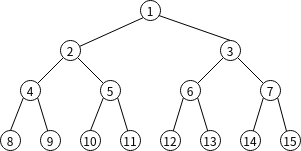
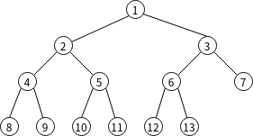
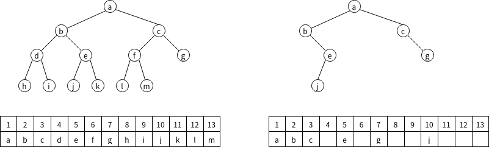
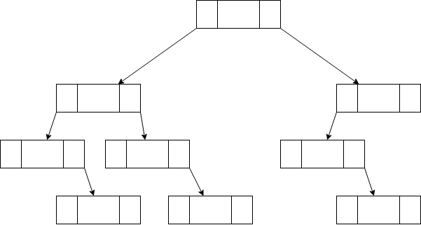
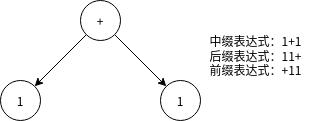
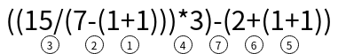
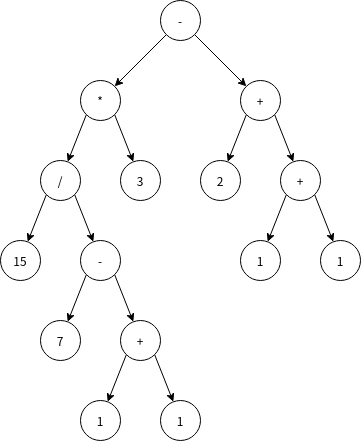
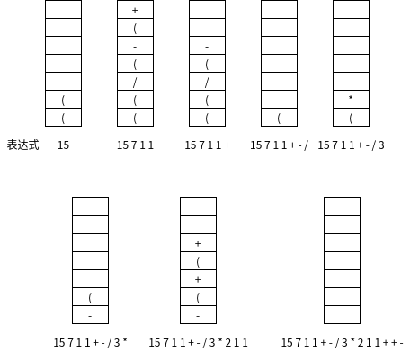
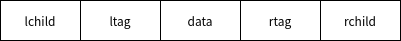

# 二叉树

二叉树的特点三每个节点最多有两个子女

区分度为2的树和二叉树：

-度为2的树至少有一个节点的度为2,且树中节点度最大为2
-二叉树是节点的度最多为2,可以没有度为2的节点

二叉树有以下性质：

- 二叉树第i层的节点数最多为$2^{i-1}$个
- 深度为k的二叉树最多有$2^k-1$个节点，最少有$k$个节点
- 对任意非空二叉树，如果其叶节点数为$n_0$,度为2的非叶节点数为$n_2$，则有$n_0=n_2+1$
- n个节点的二叉链表有n+1个空链域（可用于线索化）

## 特殊的二叉树

满二叉树：二叉树的每层都填满节点

完全二叉树：每个节点的编号和满二叉树一一对应

完全二叉树具有以下特性：

- 深度为h的完全二叉树至少有$2^{h-1}$个节点
- 有n个节点的完全二叉树高度为$\lceil\log_2(n+1)\rceil$
  推导：深度为k的完全二叉树，节点数满足$2^{k-1}-1(前k-1层的总节点数)<n\le2^k-1$可得$k-1<\log_2(n+1)\le k$即$k=\lceil\log_2(n+1)\rceil$
- 对于编号为$i$的节点，若其有左子树$(2i\le n)$，其左孩子编号为$2i$,若其有右子树$(2i+1\le n)$，其右孩子编号为$2i+1$。父节点编号$[i/2]$
  
## 二叉树的存储结构

### 顺序存储

对于**完全二叉树**和**满二叉树**而言，顺序存储是最简单，最节省存储的存储结构。只需定义一个一维数组，将**完全二叉树**和**满二叉树**按照顺序写成一个线性序列放入一维数组即可。

对于普通的二叉树，为了体现出二叉树的逻辑结构，节点必须按照存储满二叉树那样进行编号，写成线性序列，空节点则假定为没有元素的节点也进行编号，然后进行存储。这样会浪费大量的存储空间.故对于一般的二叉树，我们采用二叉链表存储

### 链式存储（二叉链表）

~~~c
typedef struct BiTNode{
	int data;
	BinNode *lchild, *rchild;
}BitNode, *BiTree
~~~

# 二叉树的遍历(重点)

> 近年来，对二叉树遍历的考察频率降低，但在408越来越重视树，图这类算法的趋势下，这块内容还是很有可能出题的

二叉树有三种遍历方式：前序遍历，中序遍历，后序遍历

所谓的前中后，是指这三种遍历对根节点的访问优先度

前序遍历先访问根节点，再访问左子树，最后访问右子树。对每颗子树的访问也遵循这个顺序

~~~c
  void preOrder(BiTree T){
	if(T!=NULL){//不为空树，访问
	  visit(T);//自定义的访问函数
	  preOrder(T->lchild);//遍历左子树
	  preOrder(T->rchild);//遍历右子树
	}
  }
~~~

中序遍历先访问左子树，再访问根节点，最后访问右子树。对每颗子树的访问也遵循这个顺序

~~~c
  void inOrder(BiTree T){
	if(T!=NULL){//不为空树，访问
	  inOrder(T->lchild);//遍历左子树
	  visit(T);//自定义的访问函数
	  inOrder(T->rchild);//遍历右子树
	}
  }
~~~

后序遍历先访问右子树，再访问左子树，最后访问根节点。对每颗子树的访问也遵循这个顺序

~~~c
  void postOrder(BiTree T){
	if(T!=NULL){//不为空树，访问
	  postOrder(T->lchild);//遍历左子树
	  postOrder(T->rchild);//遍历右子树
	  visit(T);//自定义的访问函数
	}
  }
~~~

值得注意的是，若使用二叉树表示表达式，利用前序，中序，后序遍历可以分别得到前缀表达式，中缀表达式，后缀表达式

## 二叉树，栈的应用之计算机中的表达式求值

在小学时，我们便学过如何进行四则运算，大概遵循**从左到右，先乘除后加减，括号内先算**的原则，下面是一个很常见的算术表达式

$((15\div(7-(1+1)))\times3)-(2+(1+1))$

其中我们定义：

- 界限符：‘(',')'
- 操作数：数字
- 运算符：加减乘除
上面的表达式就是我们所说的**中缀表达式**，在数学中，还有**后缀表达式**和**前缀表达式**

前缀表达式即运算符放在两个操作数前面

后缀表达式即运算符放在两个操作数后面，如$1+1的后缀表达式就是11+$，这种表达式对于人类来说似乎一头雾水，但对于计算机运算而言非常方便（后文会讲述）

表达式的二叉树表达如下

那么，给定一个中缀表达式，如何转化为后缀表达式？

### 中缀表达式转化为后缀表达式

中缀表达式转化为后缀表达式的步骤如下：

1. 确定运算顺序
左优先：左边的运算符能先计算，就优先算左边

2. (左操作数 右操作数 操作数)->新操作数
   15 7 1 1 + - / 3 * 2 1 1 + + -
   对应的表达式树如下:
  
  
可以看出，中缀表达式就是这个二叉树的中序遍历序列，后缀表达式就是这个二叉树的后序遍历序列

### 栈实现中缀表达式转化为后缀表达式

1. 栈保存暂时不能确定运算顺序的运算符
2. 操作数直接加入表达式
3. 界限符：'('加入栈，')'则弹出栈内运算符加入表达式，直到弹出'('
4. 运算符：弹出栈内比当前运算符优先级高或等于的所有运算符，直到栈空或遇到'('，再将当前运算符入栈
5. 处理完所有字符，弹出栈内剩余运算符

### 栈实现中缀求值

两栈：操作数栈和运算符栈
从左往右扫：

- 扫到操作数，压入操作数栈
- 扫到界限符或操作符，按上文逻辑压入/弹出运算符栈
- 每弹出一个运算符，弹出两个操作数，执行运算后作为新操作数压回操作数栈

## 二叉树遍历的非递归算法

~~~c

void inOrder(BiTree T){
	InitStack(S);
	BiTree p = T;
	while(p||!IsEmpty(S)){
		if(p){
			push(S,p);
			p=p->child;
		}
		else{
			pop(S,p);
			visit(p);
			p = p->rchild;
		}
	}
}

void preOrder(BiTree T){
	InitStack(S);
	BiTree p = T;
	while(p||!IsEmpty(S)){
		if(p){
			visit(p);
			push(S,p);
			p=p->child;
		}
		else{
			pop(S,p);
			p = p->rchild;
		}
	}
}
~~~

## 层序遍历

~~~c
void levelOrder(BiTree T){
	InitQueue(Q);
	BiTree p;
	Enqueue(Q, T);
	while(!isEmpty(Q)){
		Dequeue(Q,p);
		visit(p);
		if(p->lchild!=NULL) Enqueue(Q, p->lchild);
		if(p->lchildr=NULL) Enqueue(Q, p->rchild);
	}
}
~~~

## 遍历序列构造二叉树

中序序列+任一其他一种序列可以唯一确定一颗二叉树

先序序列：第一个元素是根节点

后序序列：最后一个元素是根节点

中序序列：根节点左边是左子树，根节点右边是右子树

## 线索二叉树

二叉链表只能体现一种父子关系，而不能直接得到节点在遍历中的前驱或后继。二叉树有n+1个空链域，于是便有利用这些空链域来找到遍历前驱或后继，这便是线索化。线索二叉树就是为了加快查找节点前驱和后继的速度

当ltag/rtag=0,lchild/rchild指向左/右孩子；ltag/rtag=1，lchild/rchild指向前驱/后继

~~~c
typedef struct ThreadNode{
	Elemtype data;
	ThreadNode * lchild,rchild;
	int ltag,rtag
}*ThreadTree, ThreadNode

~~~

实际上构造线索二叉树的办法本质上是遍历二叉树，只是visit()上的不同而已

~~~c
void inThread(ThreadTree &p, ThreadTree &pre){
	if(p!=NULL){
		inThread(p->lchild, pre);
		if(p->lchild == NULL){//左子树空，指向前驱
			p->lchild = pre;
			p->ltag = 1;
		}
		if(pre != NULL && pre->rchild == NULL){//右子树空，指向后继
			pre->rchild = p;
			pre ->rtag = 1;
		}
		pre = p;
		inThread(p->rchild. pre);
	}
}
~~~

前序和后序的实现类似，不再赘述

### 中序线索二叉树的遍历

~~~c
ThreadNode * FirstNode(ThreadNode* p){//寻找p子树中序序列的第一个节点
	while(p->tag == 0) p = p->lchild;
	return p;
}

ThreadNode * NextNode(ThreadNode* p){
	if(p->rtag == 0)return FirstNode(p->rchild);
	else return p->rchild;
}

void inOrder(ThreadNode* T){
	for(ThreadNode *p = FirstNode(T);p!=NULL; p = NextNode(p);){
		visit(p);
	}
}
~~~

若rtag=0,说明p右子树不为空，根据中序遍历的性质，p的后继为**p右子树中序序列的第一个节点，即FirstNode(p->rchild)**

同理也可以得到逆向中序序列的算法，只要把上述算法中r和l互换即可
### 先序线索二叉树和后序线索二叉树

先序线索二叉树寻找前驱/后序线索二叉树寻找后继都需要知道父节点的信息

# 树，森林

## 树的存储结构

## 树，森林，二叉树三者之间的转换

### 树和二叉树

### 森林和二叉树

# 树和二叉树的应用

## 哈夫曼树和哈夫曼编码

### 哈夫曼树

### 哈夫曼编码

## 并查集

>并察集是新考点，以408的趋势，很可能进行考察

### 集合的概念

集合实际上描述的是两个元素之间的关系

### 存储结构

通常用树来表示集合；同一自己的元素组成一棵树，各个树组成的森林构成全集

在并查集中，找到元素所在树的根节点是非常频繁的操作，故采用**双亲表示法**存储并查集

~~~c
int UFsets[Size];//并查集数组

void initial(int s[]){
 	for(int i = 0; i < size; i++){
		s[i]=-1;//-1表示根节点
  	}
}

~~~

### 并，查的实现以及优化

查找：即判断元素属于哪个集合，找到树的根结点

~~~c
int find(int s[],int x){
	while(s[x]>=0){
		x=s[x];
	}
	return x;
~~~

并：让一棵树成为另一棵树的子树

~~~c
void union(int s[],int root1, int root2){
	if(root1 == root2) return;
	s[root2]=root;//root2合并到root1上
}
~~~

并操作可能会使大树合并到小树下面，导致树的高度增高，而查找效率取决于树的高度，从而导致并查集查找效率降低

并操作优化：小树成为大树的子树
~~~c
void union(int s[], int root1, int root2){
	if(root1==root2)return;
	if(s[root2]>s[root1]){//根节点数组值为负值，越大的值对应的节点数更少
		s[root1]+=s[root2];
		s[root2] = s[root1];
	}
	else{
		s[root2]+=s[root1];
		s[root1] = s[root2];
	}
}

~~~

查操作优化：找到根节点后，将查找路径上的元素挂载到根节点下

~~~c
int find(int s[], int x){}
	int root = x;
	while(s[root]>=0)root=s[root];
	while(x!=root){
		int t = s[x];
		s[x] = root;
		x = t;
	}
	return root;
~~~